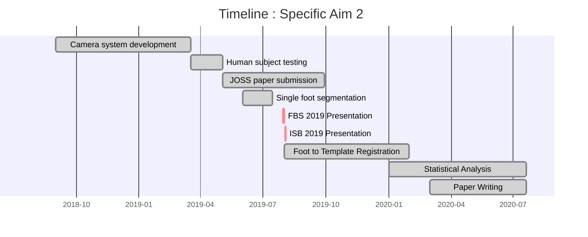
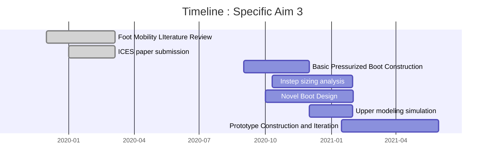
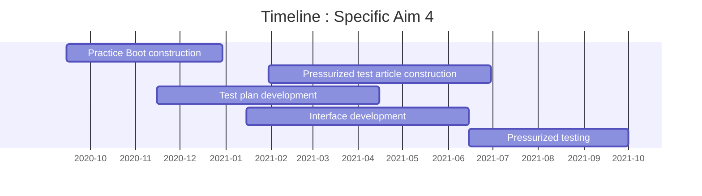
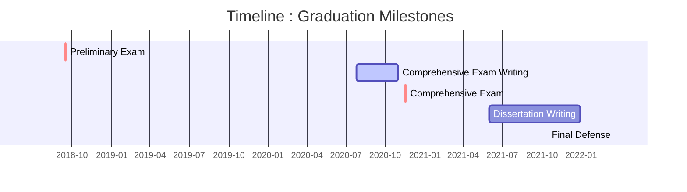
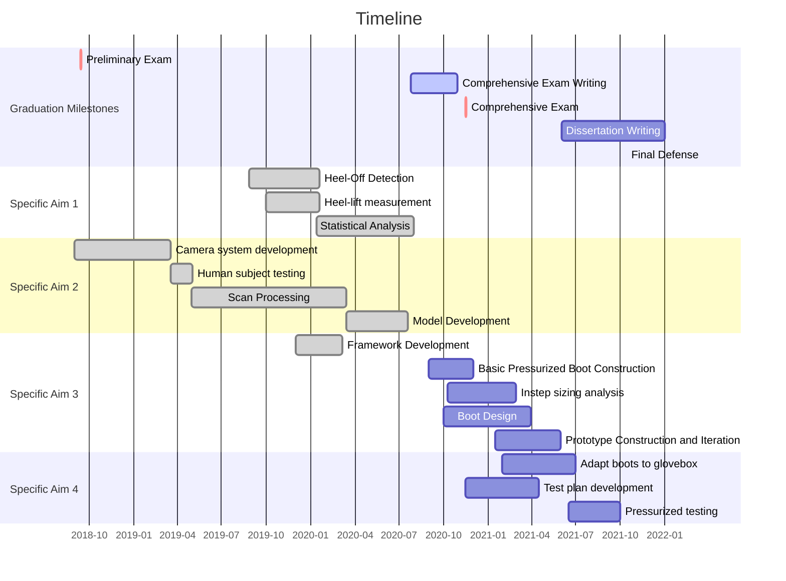

 ```mermaid
gantt
dateFormat YYYY-MM-DD
title Timeline : Specific Aim 1
axisformat %Y-%m
        Novel Data Processing           :done,    des1, 2019-08-15,2019-09-15
        IMU Data - Stance Detection     :done,  des2, 2019-08-27, 2020-01-20 
        IMU Data - Zero Velocity Update :done,  des3, 2019-10-01, 2020-01-20
        HRP 2020 Poster Presentation    :         crit, 2020-01-27, 1d
        Statistical Analysis            :active,  des4, 2020-01-13,2020-08-01
        Paper Writing                   :active, 2020-07-20,2020-10-15
 ```











