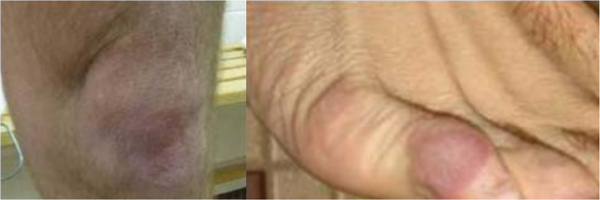
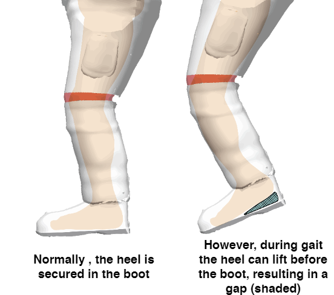

# Background

Poor suit design and suit fit are two of the main suit variables leading to injury risk and compromised performance during EVA [@Chappell2017].
Pressurized spacesuits will continue to be used for EVAs through the transition from microgravity to planetary exploration, and therefore will require improvements to their joint design and fit to ensure safe and comfortable EVA. 
As future missions target planetary exploration, ambulating across the surface becomes a critical EVA task, and requries an understanding of reduced-gravity ambulation and suited effects on ambulation. 
There are also many challenges that are associated with fitting spacesuits which have not yet been solved. 
This chapter introduces how current suits perform in planetary ambulation and introduces the challenges with fitting spacesuits. 

## Planetary Ambulation 

Walking is not always the most energetically preferable gait. 
Astronauts during the Apollo missions did not walk while traversing the surface; they famously loped across the surface. 
In fact, loping is the energetically preferred gait on the Lunar surface, while walking, skipping, and running are energetically preferable on Mars [@Ackermann2012b].
As speeds increase in lunar gravity, a transition occurs from walking to skipping rather than from walking to running as on Earth [@Minetti2012].
However, the energetically preferred speed is not always achievable or possible, and slower walking speeds may be necessary when performing EVA tasks.

Studying the walk-run or walk-skip transition gives further insight into ambulation on a planetary surface. 
Walking is modeled as an inverted pendulum which conserves some energy between each step; but energy is not conserved at faster walking speeds and needs muscular power input [@Cavagna1976;@Cavagna1977].
Griffin et al. [@Griffin1999] found as gravity is reduced, the amount of mechanical energy conserved between each step is reduced, and the maximum energy recovery occurs at slower speeds. 
Ivanenko et al. [@Ivanenko2002] found that muscle activation and ground contact forces decreased with lower gravity levels, but kinematic coordination of the lower limbs were not affected by gravity levels. 
The Froude number is the ratio between the centripetal and gravitational forces in the inverted pendulum model, as shown in [@eq:froude].
$
Fr=\frac{v^{2}}{gL}
$ {#eq:froude}

Where $Fr$ is the Froude number, $v$ is the velocity of ambulation, $g$ is the gravitational force, and $L$ is the leg-length [@AlexanderMcN.1989].
At some critical value,  walking is theoretically impossible as the gravitational force cannot match the required centripetal force, which is where the walk-run transition occurs ($Fr*$). 
Humans typically switch to running at $Fr=0.5$.
Kram et al. [@Kram1997] offloaded subjects by their waist as they walked and ran on a treadmill, and found that  $Fr*$ increases at lower gravity levels.
The increase in $Fr*$ was hypothesized to be from the arms and legs not being offloaded and still under the influence of gravity [@Kram1997]. 
Donelan and Kram [@Donelan2000] also found that elastic forces were unable to predict the dynamics of reduced-gravity running. 
This suggests that other factors may be at play with walking in reduced gravity. 

Ambulating with the suit involves additional forces both applied by the suit, and applied by the user to control the suit. 
Newman and Alexander [@Newman1993] suggested that energy may be expended at low speeds and lower gravity levels for stability and postural control for ambulation. 
Chappell [@Chappell2006] found that when the offload system was set to lock waist rotation for stability, subject's gait was constrained and showed changes in braking and propulsion force for Lunar gravity. 
Therefore, stability is an important factor in walking at lower gravity levels. 

Carr and McGee [@Carr2009] developed the Apollo number $Ap$ to explain the effects of the spacesuit's pressure forces on gait ([@eq:apollo]).

$
Ap = \frac{Fr}{M}\\
\textrm{,where $M$ is the mass ratio of the spacesuit.}
$ {#eq:apollo}

$M$ encorporates the self-supported weight of the spacesuit. 
The self-supported weight of the spacesuit is from the spacesuits pressurization. 
Carr and McGee validated the Apollo number against gait events during Apollo missions, but found that the Apollo number did not fully explain the walk-skip transitions. 
*Therefore, a gas-pressurized spacesuit's mobility restrictions and joint mechanical work, along with its pressure forces, may also be affecting suited ambulation.*

## Gas Pressurized Spacesuit Characteristics

### An Inherently Stiff Structure

Gas pressurized spacesuits have been used for all EVAs throughout the history of human spaceflight. 
However, gas pressurized suits become stiff and rigid when pressurized, requiring great effort to bend.
The first EVA spacesuit, the Gemini suit, did not include any design features to reduce bending effort [@Thomas2012].
If a gas pressurized suit component is represented as a pressurized cylinder, bending the cylinder along its axis causes a reduction in volume at the bend [@Harris2001]. 
As a result, pressure at the bend will increase, causing resistance to the bending force. 
The force required to change the volume at the bend is presented in [@eq:press] [@Newman1997;@Harris2001],
$
F = \frac{W}{d} = \frac{\frac{p\pi D^{3}\phi}{8}}{\frac{L\phi}{2}} = \frac{p\pi D^{3}}{4L}
$ {#eq:press}
where $F$ is the force required, $W$ is the work required, $d$ is the distance the joint is flexed,  $p$ is the pressure, $D$ is the cylinder's diameter, $\phi$ is the joint deformation angle, and $L$ is the length of the cylinder. 
It can be seen that the force required to bend a pressurized joint is not dependent on the bending angle, but rather the length and diameter of the pressurized section.
Without dedicated mobility features to maintain a constant volume at joints, the forces required to bend representative spacesuit components can be as high as 200 lbs for the waist joint [@Newman1997].

### Mobility Design Features

Mobility design features allow for bending of a pressurized joint by creating a point at which the joint can buckle, and allowing the joint to maintain constant volume through the bending motion [@Harris2001].
This greately reduces bending resistance and allows for joint flexibility [@Harris2001]. 
These mobility features typically feature some form of bellows or convolutes to maintain constant volume and axial restraints to prevent elongation of the joint under pressurization [@Harris2001]. 

Mobility design features have been studied and iterated since the advent of space travel, but were not implemented in the Apollo mission suits. 
The Litton company built and tested spacesuits for EVA use in the 1950s, predating both the US and Russian space programs.
These suits iterated on the use of convolutes by inventing the rolling convolute, annular convolute, and cardonic hard joint [@Harris2001].
While these suits never saw operations on spaceflight, they did prove benefits in mobility over the International Latex Corporation (ILC) designed A7L suits, which were eventually used by US astronauts on the moon. 
The Litton suits were able to match the center of restraint and center of pressure when convolute joints were bent, reducing the bending torque and spring return force of the joint [@Harris2001]. 
Therefore, the suit's operator is able to easily bend the joint and not exert much force to keep the joint bent. 
The A7L suit's convolute joints did not match the center of restraint and center of pressure, requiring operators to exert additional force to both bend the joint and keep it bent [@Harris2001]. 
Such drawbacks of the A7L suit required astronauts to come up with clever workarounds. 
On an Apollo 16 EVA, astronaut John Young found that "by hopping into the air and landing on his feet, the weight of his suit overcame the suit’s internal pressure, so he could get to his knees and pick up rocks without using geological tools" [@Portree1997]. 
Integrating convolutes into the A7L suits may have improved mobility on the Moon. 

Advancements since the Apollo era have brought us improvements in pressurized joint design to increase mobility, including the toroidal mobility joint, dual-axis joint, hard component joints, hybrid hard-component/fabric joints, and improvements to flat-patterned joints [@Harris2001]. 
The Mark III Advanced Space Suit Technology Demonstrator EVA Suit (MK III) is a spacesuit designed by NASA as a planetary spacesuit design testbed [@Kosmo1988].
These advancements have allowed for increased lower-torso mobility as shown in the MK III spacesuit technology demonstrator; operators are easily able to recover from a fall and kneel in the MK III while these tasks were done with much difficulty in the A7L and EMU spacesuits [@Kosmo1998].

Lessons from EMU and MK III design were applied to the design of the new Z2 planetary spacesuit prototype.
The Z2 prototype was first developed by NASA and ILC Dover in 2016 to demonstrate planetary surface exploration technologies, but parts of the Z2 suit are now being used for the Exploration EMU (xEMU), to supplement or replace the EMU for ISS EVAs [@Graziosi2016;@Meginnis2018].
The Z2 also serves as the basis for the design of the Artemis spacesuits, which will be worn by the first crew to step foot on the Moon. 
The Z2 spacesuit features a larger scye opening and more mobile shoulder bearings compared to the EMU [@Graziosi2016]. 
Tests of the Z2 in the NBL found range-of-motion and reach envelope improvements over the EMU, but many microgravity EVA tasks were reported to be harder and more limited in the Z2 [@Meginnis2018]. 
Subjects also reported similar muscle fatigue and exertion ratings between the EMU and Z2 [@Meginnis2018]. 
Larger subjects also reported discomfort in the shoulder area, further highlighting the importance of fit in spacesuit design [@Meginnis2018]. 
Similar analysis needs to occur with ambulation to assess the effect of suit mobility improvements.

## MK III Ambulation Performance
The MK III spacesuit has been used to experimentally study suited effects on ambulation due to the Z2's relative novelty.
In the EVA Walkback Test (EWT), six male subjects were tested with the MK III spacesuit on a treadmill to explore the effects of the MK III spacesuit's weight on planetary ambulation in Lunar (1/6g) and Martian (3/8g) gravity levels.
Subjects were tested in three conditions: unsuited and offloaded to selected gravity level; unsuited and offloaded to selected gravity level with the suit weight matched; and suited while offloaded to selected gravity level [@Norcross2009].
This allowed for analysis of suit weight separately from other suit design factors on the metabolic cost of suited ambulation.
Subjects were tested at three speeds above and three speeds below their walk-run transition speed.
All subjects also did a 1G baseline unsuited trial and a 10 km suited lunar ambulation.
A follow-on integrated suit test (IST) examined the effects of  varied suit mass, gravity, and on metabolic cost and kinematics on Lunar suited gait [@Norcross2010] with similar conditions while varying suit pressure and mass. 
These and similar tests provide insight into how the MK III's design factors affect suited ambulatory performance. 

### Cost of Transport Factors

Metabolic cost of transport, a measure of how much energy the body is exerting during ambulation calculated through direct calorimetry [@Kenny2017], was collected in these tests across a variety of conditions.
Metabolic cost is a direct measure of how hard the body is working to move in the spacesuit.
Previous studies have shown that the metabolic cost of transport decreases with gravity [@Grabowski2005]. 
Findings from the EWT and IST were consistent with these previous findings [@Norcross2009;@Norcross2010].
Unsuited weight-matched metabolic costs were lower than 1G unsuited across all speeds for 1/8G ambulation and similar to 1G unsuited for 3/8G ambulation [@Norcross2009].
This suggests that without suit effects, ambulation on Mars may be metabolically similar to ambulating on Earth. 
However, the MK III increased the metabolic cost of transport for both gravity environments compared to the unsuited weight-matched condition [@Norcross2009].
At 1/6G, the MK III had a higher metabolic cost than Earth ambulation at lower speeds, but was less metabolically costly at higher speeds [@Norcross2009;@Norcross2010].
The MK III was very metabolically costly in 3/8G, metabolic cost quickly approach maximal values for low speeds and subjects were unable to run in the suit at higher speeds [@Norcross2009].
The metabolic cost of weight (5%-13%) for both Lunar and Martian gravity levels was significantly dwarfed by the cost of suit design factors (87%-95%) [@Norcross2009].
From these results, its apparent that the MK III's design cannot service ambulation on Mars due to its design factors, but may be sufficient for the Moon. 

Other suit design factors partially explained the increased metabolic cost of suited ambulation. 
The IST found increased suit pressure to minimally increase metabolic cost across all speeds, hypothesized to be due to the MK III's constant volume joints [@Norcross2010].
However, there were some subjective differences in mobility noted across the different pressures, although there was no correlation to subject anthropometry [@Norcross2010].
The effect of suit weight, which encompasses gravity level and suit mass, steadily increased with speed [@Norcross2010].
The percentage of metabolic cost that was not explained by suit weight or pressure decreased as speed increased, but then increased at the fastest speed [@Norcross2010].
Additional factors which can explain the increased metabolic cost can include suit kinematics, stability, and harnessing effects from the gravity offloading, which may be causing more difficulty for ambulation at lower speeds. 
However, these factors were not isolated in the MK III ambulation experiments. 
The majority of ambulation during an EVA is most likely done at lower speeds, thereby requiring further understanding of how suit design is affecting mobility at low speeds. 

### Ambulation Biomechanics

The IST captured little differences in kinematics as a function of pressure, which may be due to the constant volume joints [@Norcross2010].
However, it was noted that at 4.3 psi, the knee joint was limited by the design of the pressurized suit, and that the ankle increased its range-of-motion (ROM) to compensate the limited knee ROM [@Norcross2010].
This shows the importance of the kinematic chain in suited mobility; when a certain motion is inhibited, other joints along the kinematic chain will have to compensate. 
Similar compensation has led rotator cuff injury in the EMU's HUT [@Williams2003]. 

Cullinane et al. [@Cullinane2017a] found suited MK III ambulation at 1G to reduce heel and toe clearance above ground compared to unsuited ambulation. 
In addition, the MK III was found to decrease speed, stride length, and step length compared to unsuited ambulation [@Cullinane2017a].
Cadence and stance time increased with gravity level in the IST, consistent with how metabolic cost increases with gravity level [@Norcross2010].
These findings suggest that the MK III inhibits operator mobility and agility when ambulating. 

### Subjective Feedback

Subjective feedback allows operators of the MK III to provide their perception of ambulating in the suit. 
Rating of Percieved Exertion (RPE) and Gravity Compensation and Performance Scale (GCPS) were consistent with metabolic cost findings in both the IST and EWT; both increased with gravity and speed [@Norcross2009; @Norcross2010].
Subjects performing the 10 km suited lunar ambulation in the EWT reported "fair" to "moderate" operator compensation required to walk in the MK III on the Cooper-Harper Scale [@Norcross2009].
While mean rating of discomfort was "very low" to "low" on the Corlett-Bishop Scale, discomfort and trauma were noted on the knees and feet of some subjects [@Norcross2009] ([@fig:B-Trauma]). 
In addition, muscular fatigue and tightness was also reported in the quadriceps, thighs, glutes, and lower back [@Norcross2009].

Subjective feedback for ambulating in the MK III at 1/6-g suggests that it is mostly acceptable for lunar ambulation. 
However, the reported trauma and musculoskeletal discomfort are areas of concern. 
The EWT and IST, along with findings from Cullinane et al. [@Cullinane2017a], show that the MK III's design inhibits natural human motion and requires more effort during suited ambulation. 
It is not enough, however, to design a suit that more closely matches natural human motion; it also needs to work closely with its operator to reduce injury risk from poor fit. 

{#fig:B-Trauma width="80%"}

## Spacesuit Fit

Spacesuit mobility needs to have matched spacesuit-operator interaction, primarily driven by spacesuit fit, to ensure the suit works with its operator. 
Proper spacesuit fit requires both correct sizing and correct indexing between the spacesuit and its operator. 
In addition, these factors must be maintained not only in a static pose, but through dynamic movements as well. 
Static fit refers to the alignment between the operator and the spacesuit, while dynamic fit refers to the coordination of the operator to the spacesuit during motions [@Stirling2020]. 
Poor static fit leads to empty space around the operator, which allows the operator to move inside and repeatedly contact the spacesuit. 
However, improving static fit is not as easy as filling this empty space; this would hamper operator mobility and lead to poor dynamic fit and difficulty for the operator to move the suit. 
In addition, the effect of fit on suited performance is difficult to understand. 
Difficulty in both sizing the suit and ensuring that suit movements match operator movements may be further improved through body shape modeling. 

### Spacesuit Sizing Process

The Apollo EVA spacesuits were custom tailored for each individual, a feat achievable with the small number of astronauts needing EVA suits [@Harris2001].
However, with a larger and more diverse astronaut corp, custom suits became infeasible. 
Currently, only the EMU glove is custom made if one which fits the astronaut does not exist [@Chappell2017].
NASA STD-3000 calls for spaceflight hardware to accommodate an anthropometric range from the 5th-percentile female to the 95th-percentile male [@NASA1995]. 
The EMU suit was designed to target this range with modular and adjustable components. 
However, the EMU design only ended up fitting a 40th-percentile female to a 95th-percentile male [@Kim2019].
In addition, it is not clear what measurement is used to define the population percentiles that the EMU fits.

Even with some adjustable sizing components in the EMU, it takes experienced suit engineers to select and adjust the size of EMU components to best fit the operator.
Sizing rings are used in the EMU design to change the length of components like arms and legs [@Harris2001].
Sizing inserts such as pads can also help position the operator within the spacesuit [@Chappell2017].
The length of restraint straps at convolute joints can be adjusted to change the length of soft components, but this affects joint mobility as the length-diameter ratio is modified [@Harris2001]. 
Current suit fit processes do not use any objective measures to define proper fit; a baseline fit is prescribed from anthropometric measures and then iterated through subjective feedback [@Fineman2017].
Fit is inherently difficulty to objectively measure due to the challenges of measuring operator motion inside the suit. 

### Quantifying Fit

Novel measurement technologies have been explored to measure operator motion inside the spacesuit as traditional optical motion-capture techniques cannot be used through the spacesuit. 
Pressure sensors can help quantify contact between the operator and spacesuit and highlight hotspots of contact which can indicate poor fit [@Anderson2014; @Anderson2015;@Anderson2015b].
Inertial-measurement unit (IMU) systems aim to provide some insight into how the operator is moving relative to the suit [@Bertrand2014; @Fineman2018; @Shen2019].
Fabric strain sensors have also been developed to predict an operator's body-shape inside the spacesuit [@Kim2019]. 

Fineman et al. [@Fineman2018] introduced two objective fit metrics which can help characterize poor static and dynamic fit in the spacesuit: difference in knee angle ROM between the suit and operator, and the relative coordination metric [@Fineman2017a]. 
The relative coordination metric allows for the identification of whether the suit or the operator is driving the other component. 
Fineman et al. [@Fineman2018] measured these metrics with IMUs placed on the lower torsos of both the operator and the spacesuit. 
Three subjects walked in a spacesuit with different levels of padding, meant to mimic three different levels of fit.
Two subjects had reduced knee ROM compared to unsuited ambulation. 
One subject had no significant differences in metrics between padding levels but reported better responsiveness with higher levels of padding.
Another subject had the lowest knee ROM with no padding, aligning with their feedback that higher levels of padding are harder to control.
Results from this study show how some performance metrics can measure the effects of varying fit, but also how fit is very subjective. 

Suit fit engineers have commonly reported a dynamic fit problem where the heel lifts out of the boot during heel-off, as shown in [Figure @fig:B-HeelLift].
This was also reported by one subject in Fineman et al. [@Fineman2018].
Data collected from Fineman's study shows that during heel-off, the suit appears to be driven by the operator at the calf. 
While this may suggest heel-lift, it does not corroborate the subjective reports of a gap between the operator's heel and the spacesuit's heel as it cannot directly measure this gap. 
Fineman et al [@Fineman2018] suggests that boot fit may be very important to ambulating in the MK III spacesuit.

{#fig:B-HeelLift width="60%"}

### Body Shape Characterization to Improve Fit

NASA's Anthropometry and Biomechanics Facility (ABF) has focused on characterizing the human body as it relates to spacesuit fit. 
Linear measurements are traditionally used in sizing algorithms to determine a baseline suit fit. 
These linear measurements are then compared to linear measurements in the suit's design to determine appropriate sizing components. 
However, linear measurements do not always accurately represent a person's body shape [@Margerum2010].
Three-dimensional scanning can help accurately characterize body-shape to allow for virtual fit testing against 3D models of the suit. 
Boundary manikins can be generated which represent the extremities of accommodated anthropometry, and overlaid on 3D suit models to determine fit [@Margerum2010].
Virtual fit check metrics may include penetration depth, contact areas, and overlap volume [@Kim2019]. 
Monte-Carlo simulations of vast databases can also be virtually tested to find fit problems that may occur outside the boundary manikins [@Kim2019].

However, static body shape may not be enough to ensure dynamic fit. 
It is well known that parts of the body change shape during movement. 
Capturing 3D-scans in multiple poses also allows for the development of a parametric models that can estimate how body shape changes with a specific movement; for example this can be used to check for shoulder clearance around the HUT [@Kim2016].
This can greatly improve dynamic fit as it ensures the HUT accommodates the shoulder throughout its entire motion. 
However, this methodology is limited to poses where the subject can pause between motions due to technological limitations for capturing dynamic body shape changes. 

Body shape changes can also occur from exposure to an altered-gravity environment. 
The ABF found on average posture to increase by a maximum of 3%, hip circumference to decrease by a mean of 7%, and thigh circumference to decrease by a mean of 10% during microgravity spaceflight [@Kim2019]. 
EMU sizing incorporates a 2.54cm increase in torso length to accommodate this change [@Thornton1987]. 

Information from virtual fit testing can be incorporated into spacesuit design by informing where the internal geometry may need to be expanded or contracted to better fit the target population [@Kim2019]. 
This process was used to validate the design of the Z2 suit. 
However, it is virtually impossible to incorporate personal preferences of fit into this process; currently a threshold is implemented to determine acceptable levels of ease or compression [@Kim2019].
In addition, modifying design to accommodate findings from fit can only be done to a certain extent; there are limitations on modifying the structure of an existing design while still meeting the same engineering requirements. 
There are also no clear metrics for translating virtual fit testing into spacesuit component design, and current methodologies are limited to modifying the design of exisiting components rather than designing new components from the ground-up. 

## Summary

Ambulating on another surface and gravitational environment presents many challenges of its own, including changes in preferred gait patterns. 
Wearing a stiff, pressurized spacesuit further increases the effort required to walk.
While constant volume joints may reduce pressurization effects, unquantified factors such as poor operator-spacesuit interaction may also be leading to injury.
Spacesuit fit is hard to characterize due to limited knowledge of in-suit motion and challenges including limited suit sizing components, limited suit design flexibility, an incomplete understanding of body shape changes, and lack of quantifiable metrics to validate fit. 
Poor fit can reduce performance and lead to injury. 
Ambulation specific fit issues, such as heel-lift, have been subjectively identified in the MK III but not fully quantified. 
While there has not been a large scale study on injuries in the MK III, these fit issues are similat to the injury mechanisms leading to injury in the EMU. 

Body-shape models have been proposed as a way to better fit operators to spacesuits. 
Static body shape models allows for correctly sized spacesuit components to be selected and spacesuit component designs to be validated for accommodation of a target population. 
Dynamic body shape models will ensure that dynamic fit is ensured throughout suit motions, but current technology is limited to capturing low-frequency motions. 
In addition, there is no established framework for integrating dynamic body-shape models into the spacesuit design process.
Suit components designed around dynamic body shape models have not yet been tested for increased fit and comfort compared to traditionally designed and fitted suit components. 

