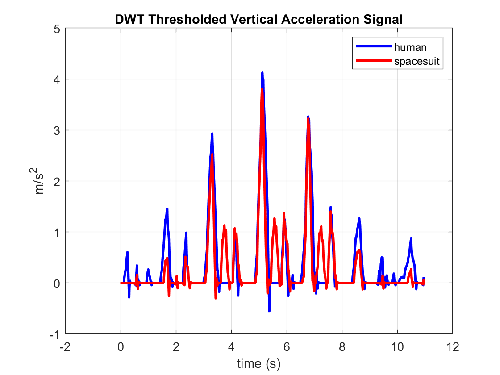

# Specific Aim 1 : Quantifying heel-lift during gait in the spacesuit

## Introduction

Heel-lift is a subjectively reported fit issue with the MK III spacesuit boot; the operator's heel inside the boot lifts inside the boot before the heel of the boot lifts at heel-off [@Fineman2018].
Quantifying heel-lift's kinematics will provide insight into its mechanism. 

The data collected by Fineman et al [@Fineman2018] used inertial measurement units (IMUs) placed on corresponding locations of the operator's and MK III's lower torso.
IMUs measure the acceleration and orientation of the segment they're attached to, but can be subject to error in the spacesuit environment [@Bertrand2016;@Shen2019;@Shen2020]. 
Heel-lift can be characterized as the delay of heel-off between the human and spacesuit; essentially, the human experiences heel-off prior to the spacesuit doing so. 
IMUs have been widely used in the biomechanics field to detect heel-off points during gait [@Rebula2013;@Fischer2013]. 

Therefore, this work's objectives include:
- detect heel-off times of both the spacesuit and the operator using the IMUs to detect the presence of heel-lift. 
- measure the amount of heel-lift experienced by the human
- identify the relationship between lower torso fit and heel-lift

## Methods

Experimental data collected by Fineman et al [@Fineman2018] was reanalyzed for this study.
Three subjects walked along a 10m walkway for 24 trials in each of four conditions: unsuited, MK III with no padding, MK III with low padding, and MK III with high padding. 
All three subjects wore the same size MK III lower-torso, but Subject 3 wore a BOA-laced boot while other subjects wore a standard strap-laced boot. 
Padding and IMU locations are shown in [@fig:SA1-Loc]. 

|Operator IMU Placement | Spacesuit IMU Placement |
|-|-|
|sacrum|bottom of HUT|
| right thigh | right upper leg |
| left thigh | left upper leg |
| right shank | right lower leg|
| left shank | left lower leg|

{#fig:SA1-Loc}

The right and left shank/lower leg IMUs' vertical acceleration and Euler pitch angles were analyzed. 
Figure XX shows the overall workflow of this analysis, with details outlined in the sections below.

### IMU Data Filtering

#### Acceleration Data
Vertical acceleration data is de-trended to remove bias by removing the best straight-fit line from the data vector. 
A low pass-filter reduces high-frequency noise in the signal.
Antonsson and Mann (1985)[@Antonsson1985] found that 98% of the signal power in gait's vertical amplitude was contained below 10 Hz.
Therefore, the data was filtered with a 5th-order low-pass Butterworth filter with a cutoff frequency of 10 Hz. 
A moving-average filter is used to smooth the dataset, remove any noise left from low-pass filtering. 
The moving average filter is widely used to detect gait-events from IMU data[@Han2019]. 
A moving average filter produces a similar response to a low-pass filter. 
A window of 30 samples (.23s) is used; this value was found through trial-and-error. 
A 30-sample window is approximately equal to a ~4Hz low-pass filter. 
This window is within the range of windows used for walking-speed estimation [@Byun2019]. 

The vertical velocity of the tibia and SLL is derived by integrating the de-trended, downsampled, and low-pass filtered vertical acceleration IMU data. 
The unfiltered vertical velocity if shown in [@fig:SA1-TibVertRaw]
However, simple integration introduces drift. 
Therefore, a high-pass filter is implemented prior to the integration of the  acceleration data to reduce drift, which occurs at a fairly low frequency (<<1Hz) [@Sekar2015]. The data was filtered with a 5th-order high-pass Butterworth filter with a cutoff frequency of 0.7Hz [@Ribeiro1999]. The filtered data is shown in [@fig:SA1-TibVertFilt]. 

{#fig:SA1-TibVertRaw }

{#fig:SA1-TibVertFilt}

#### Angular Data

The unprocessed pitch angle is shown in [@fig:SA1-PitchRaw].
The pitch angle is normalized to it's first value in the time series for each trial. 
A moving average filter with a window of 10 samples, set through trial and error, was used to smooth the pitch angle, and is shown in [@fig:SA1-PitchFilt].

{#fig:SA1-PitchRaw }

{@fig:SA1-PitchFilt}

### Step Segmentation

Each step taken by the subject was identified using detected peaks in pitch angle of the IMUs.
These peaks are thought to correspond to the max posterior flexion/extension of the tibia/SLL during the swing phase.
The parameter *MinPeakDistance* is set to 1.5s to ensure high-frequency peaks are not detected; this parameter was set based on the observed length of each step typically taking longer than 1.5s. 

Since the first and last peaks of the trail may not be complete steps, they were not included in the analysis.
The parameter *MinPeakProminence* is set to 0.40 radians (23 degrees) to ensure that the first and last peaks of the steps are not detected, as they were observed to be lower than this value across all trails. 
Peaks which corresponded to complete steps were observed to be closer to 0.60 radians (35 degrees). 
Each step is defined as the time between each step's max extension to the following step's max extension. 
An example of the step detection for a single trial is shown in [@fig:SA1-StepSeg].

{#fig:SA1-StepSeg }

Once the locations of the peaks are detected, they are reshaped into an array which represents the start and end indices of each step. 
Since the peak detection is not a perfect algorithm, the number of steps detected in one trial for the SLL and tibia might not be the same. 
Therefore, whichever IMU had the least amount of steps detected has its step times applied to the other IMU. 
However, this is a very rare occurance (<10 trials), occurring only when a step may not meet the *MinPeakProminence* threshold for either the tibia/SLL IMU, while meeting the threshold for the other. 

### Foot-flat Phase Detection 

The foot-flat phase is the time duration between toe-strike and heel-off, where the foot is flat on the ground. 
This phase is characterized by very low anterior-posterior acceleration; since the foot is flat on the ground, there is very little vertical movement of the shank [@Rebula2013]. 
To more accurately identify this phase, a 3-level discrete wavelet transform (DWT) is applied to the de-trended, low-pass filtered, smoothed human and spacesuit anterior-posterior acceleration signals. 
The DWT works as a cascading filter bank at each level, simultaneously low-pass and high-pass filtering. 
A ``sym2`` Symlet is used as the mother wavelet for the transform, due to its high performance in detecting initial-contact and final-contact points during stance phase [@Ji2019]. 
After transforming to wavelet space, a threshold is applied where values below 2% of the maximum wavelet coefficient are set to zero. 
The wavelet coefficients are then reconstructed back into a signal. An example of DWT thresholding is shown in [@fig:SA1-DWT]. The reconstructed DWT acceleration data is used to detect foot-flat phase. 

{#fig:SA1-DWT }

#### Finding Zero-Acceleration Points

Foot-flat phase is detected by looking for the zero regions in the anterior-posterior acceleration's derivative[@Mariani2013].
A threshold of $0.01 m/s^{2}$ was set to account for small amounts of noise in the DWT signal. 
Acceleration points within this threshold were identified as zero-acceleration points. 
Zero-acceleration points less than 3-samples long are removed, since foot-flat phase is expected to be much longer. 
The end of foot-flat phase is estimated to be heel-off. An example of detecting stance phase is shown in [@fig:SA1-Stance].

{#fig:SA1-Stance }

### Zero Velocity / Zero Position Update

Zero-velocity and zero-position updates are used to reduce integration drift and improve the accuracy of the positional estimate of the tibia and SLL.
The high-pass filtered vertical velocity signal is put through a low-pass 6th order Butterworth filter with a cutoff frequency of 6 Hz. 

It is known that the vertical velocity during stance should be zero, but drift from integration will offset this value. 
Therefore, the vertical velocity at heel-off is set to 0, and the vertical velocity after heel-off is subtracted by the velocity reported at heel-off weighted based on the distance from the heel-off timepoint using the following formula [@Feliz2009]:

$$
v'_{x,i} = v_{x,i} - v_{HO}*\frac{t_{i}-t_{TS}}{t_{HO}-t_{TS}}
$$

Where at timestep $i$ after heel-off:

*  $v'_{x,i}$ : corrected velocity
*  $v_{x,i}$ : original velocity
*  $t$ : time
*  $TS$ : at next toe strike
*  $HO$ : at heel-off

To calculate the position of the tibia and SLL from heel-off, the integral of the corrected velocity is taken. 
Assuming the interface between the heel and boot is at point 0, taking the integral only from the estimate of heel-off acts as a zero-position update, under the assumption that just before heel-off, the heel and boot are flat on the ground. An example of the positional difference is shown in [@fig:SA1-position]

Since drift is not completely eliminated with the methods outlined, bounds need to be established where we can take the positional difference with confidence that the difference is not largely due to the drift. 

While drift is not exactly a linear process, we made an assumption that finding the average drift value between two known points would be a reasonable approximation to quantify how drift accumulates over time in this scenario. 

Analysis was conducted to determine the rate of drift after the ZVU/ZVP updates were performed.
During stance phase, it's expected that both the SLL and tibia will have the same vertical position at toe-strike and heel-off. 
During swing phase, it is expected that both IMUs will return to the same vertical position after each step. 
Therefore, to calculate drift rate, the position values at the beginning and end of stance phase and swing phase were subtracted from each other, and then divided by the time of each phase, to get a drift rate. 
This rate represents the amount the IMU's positional estimate has drifted over each phase, when it is expected to return to 0. 

| IMU   | Stance Phase Median Drift Rate | Swing Phase Median Drift Rate |
| ----- | ------------------------------ | ----------------------------- |
| Tibia | 9.48 cm/s                      | 14.15 cm/s                    |
| SLL   | 26.33 cm/s                     | 27.48 cm/s                    |

From this analysis, a limit of 0.04 s (1/26.33 cm/s) was used to take the positional difference between the SLL and tibia after heel-off, to measure heel-lift. 

{#fig:SA1-position }

### Outlier Step Removal

The heel-off detection was not perfect. 
In some cases, it failed to properly detect heel-off for the human or spacesuit with the parameters provided. 
Heel-off lag times <-0.2s and >0.2s were manually inspected, and if the detection times were incorrect, these steps were taken out of the analysis. A total of 32 steps were removed with this analysis. 

For Subject 2, Configuration 2, the left tibia IMU dropped out. These steps were left out of the analysis. 

For Subject 4, Configuration 0, Trials 1-12, the labels for the left and right IMUs seemed to be switched; the left SSL IMU was  aligned with the right tibia IMU and vice-versa. Therefore, for these trials, the tibia IMU was switched to the other side. Since we don't know which IMU in particular was mislabeled, we don't know if the new labels are right for these trials. However, since we are not analyzing our data by sides, this data was left in the analysis. 

## Results

Heel-off lag is measured by subtracting the heel-off time of the tibia from the heel-off time of the SLL.
However, since 0.04 seconds is a very small amount of time, it was decided to not record any heel-lift measures, as any heel-lift measurement would be minimal taken 0.04 seconds after heel-off. Measurements taken after this point may not be trustworthy due to the presence of accumulating drift. Therefore, heel-off lag was chosen as a proxy-representation of heel-lift; when there is lag in heel-off between the human and spacesuit, it  is assumed to be accompanied by heel-lift. 

Figure {@fig:heeloffdist} shows the distribution of heel-off lag measurements in violin plots. 
It seems that subject 4 is the only subject to experience a "negative" heel-off lag.
Subjects 2 and 3 experience only "positive" heel-off lag, which would suggest that these subjects experienced heel-lift. 

"Negative" heel-off lag is technically impossible: when the spacesuit experiences heel-off, it will also push on the human-heel, causing it to experience heel-off as well. 
Another explanation for this vertical acceleration is spacesuit leg lengthening, where during foot-flat phase, the spacesuit lower leg slowly expands in the anterior-posterior direction, causing the mounted IMU to register a positive acceleration. 
This may be due to interactions at the knee joint or from femur movement. 

For subject 4, it is difficult to say whether they experienced heel-lift, since the distribution of lag seems to be centered around 0. Since Subject 4 has the largest crotch height, knee height, hip breadth, and thigh circumference, they may have some interaction within the lower torso to cause SLL leg lengthening. 

{#fig:heeloffdist }

Figures {@fig:humanlag; @fig:sslag} show example zoomed-in views of the foot-flat phase for the DWT acceleration signal.
Foot-flat is where both the blue (human) and red (spacesuit) lines are flat, and are shaded with the respective colors for the spacesuit and human. 

In {@fig:humanlag}, the spacesuit has some vertical acceleration before the human, suggesting that it may experience heel-off before the human does inside the spacesuit. 

{@fig:sslag} shows an example where the human has some vertical acceleration before the spacesuit, which may suggest that they experienced heel-lift. 
As the human lifts their leg to initiate movement, the spacesuit does not respond and therefore does not experience heel-off at the same time, leading to heel-lift.  

{#fig:humanlag }

{#fig:sslag }

## Summary
Presence of heel-lift was able to be detected by the methodology outlined in this specific aim, however it was unable to be reliably quantified due to the short confidence bounds from which a measurement can be taken. 
Heel-lift was detected for Subjects 2 and 3, but there was no noticeable effect of padding on heel-lift presence.
Subject 4 seemed to be experiencing suit pressurization effects lengthening the lower leg during heel-off. 
This may be due to their larger lower-torso anthropometry. 
Fineman et al [@Fineman2018] suggested that relative coordination of the lower-torso may be affected by boot fit issues. 
However, results from this analysis suggest that boot-fit issues may be due to mismatch of lower-torso fit, and reiterate the importance of the kinematic chain in providing mobility. 
While this study was not able to quantify the amount of heel-lift, it does present a new method to detect heel-lift by using biomechanics analysis techniques. 
These techniques have been validated for non-suited applications, but future work may try to validate these techniques for suited applications with the addition of a contact sensor below the heel to detect heel-lift. 

Currently, all analysis is complete with this work.
This work is currently in preparation as a technical note to be submitted for peer-review. 

