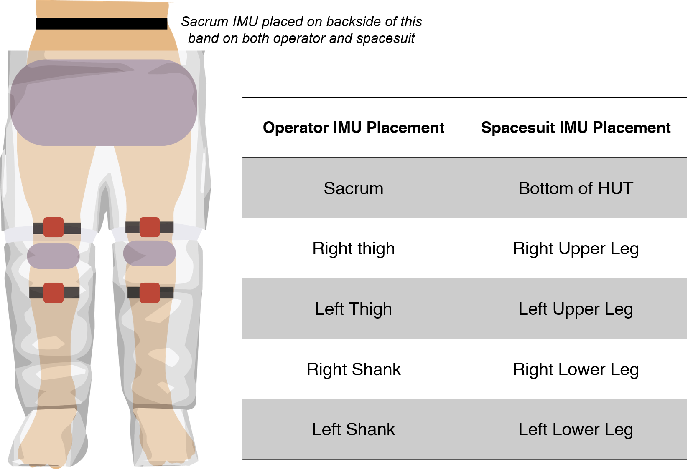
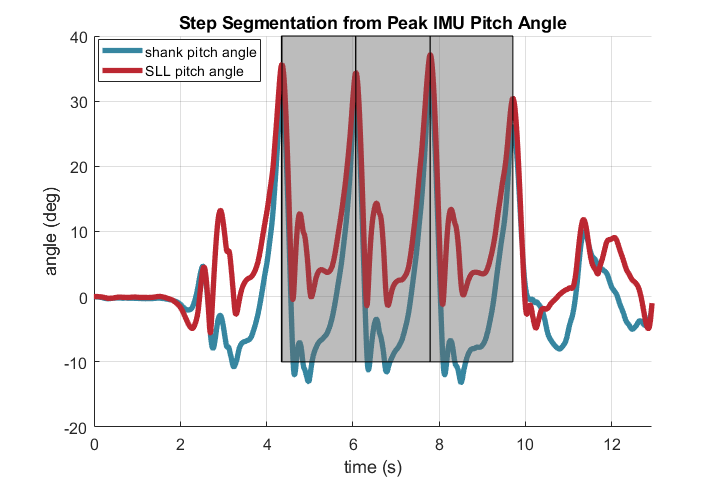
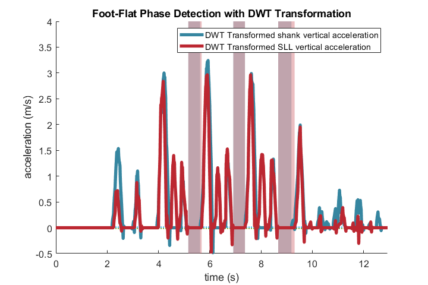
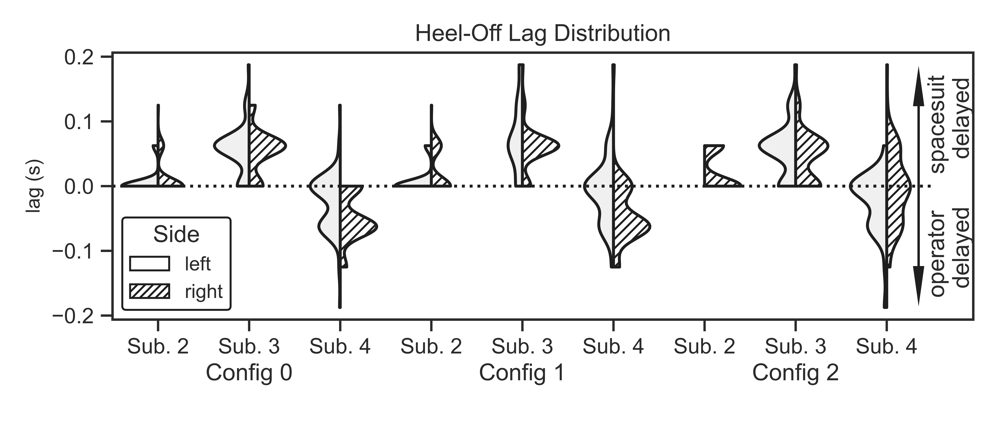
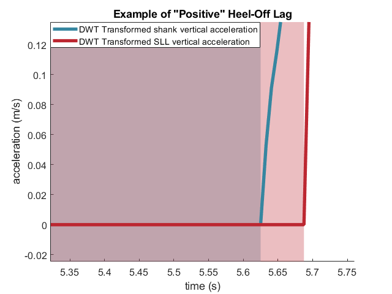

# Specific Aim 1 : Quantifying heel-lift during gait in the spacesuit

## Introduction

Heel-lift is a subjectively reported fit issue in the MK III spacesuit; described as when the the operator's heel lifts inside the boot before the boot's heel lifts off the ground at heel-off [@Fineman2018].
Heel-lift is an indicator of poor fit, leading to improper indexing of the ankle joint as the wearer goes to take a step. 
This could lead to injury through excessive contact or ankle joint overuse when taking a step.
A better-fitting boot can help mitigate heel-lif by captures the heel to prevent it from lifting during heel-off.

Designing such a boot, however, is difficult without knowing the frequency and magnitude of heel-lift; the challenges of measuring in-suit motion means that no direct measurements have been taken to date. 
Fineman et al [@Fineman2018] used inertial measurement units (IMUs) to measure in-suit lower-torso kinematics of subjects walking with the MK III spacesuit. 
IMUs measure the acceleration and orientation of the segment they're attached to, and have been successfully used in the biomechanics field to detect heel-off points during gait [@Rebula2013;@Fischer2013]. 
Heel-lift can be characterized as a lag between the operator's and spacesuit's heel-off times; essentially, the operator experiences heel-off prior to the spacesuit doing so.
IMUs were placed on both the operator's shank and the spacesuit's lower leg assembly (SLL), and it is assumed that the shank and SLL have a rigid connection their respective ankle joints.
Therefore, the difference between the shank's and SLL's vertical position taken after the operator's heel-off time is the magnitude of heel lift. 
While double-integrating an IMU's vertical acceleration signal is subject to integration drift, zero-velocity (ZVUs) and zero-position updates (ZPUs) have been used in the biomechanics field to correct for drift at every step [@Feliz2009; @Rebula2013]. 
However, IMUs are also subject to additional error in the spacesuit environment [@Bertrand2016;@Shen2019;@Shen2020], bringing into question the feasibility of using these  filtering methods on IMU data to detect heel-lift. 

Therefore, this work aims to evaluate the ability of IMUs to quantify the frequency and magnitude of heel lift through the following objectives:

- Detect heel-off times of both the spacesuit and the operator during suited walking trails where IMUs are placed on the lower-torso of both the spacesuit and operator
- Evaluate the feasibility of zero-velocity and zero-position updates to reduce integration drift and quantify the magnitude of heel-lift 

## Methods

### Experimental Design

Experimental data collected by Fineman et al [@Fineman2018] was reanalyzed for this study.
Three subjects walked in the MK III spacesuit with different padding levels at the hip and knee. 
Padding is frequently used to help index the operator's joints to the spacesuit joints. 
The subjects walked along a 10m walkway in each of four conditions: unsuited, MK III with no padding, MK III with one layer of padding, and MK III with two layers of padding.
Only the suited data was used in this analysis. 
All three subjects wore the same size MK III lower-torso, but Subject 3 wore a BOA-laced boot while other subjects wore a standard strap-laced boot. 
IMUs were placed in corresponding locations on the operator's and spacesuit's lower torso, as summarized in [@tbl:SA1-IMU].
Padding and IMU locations are shown in [@fig:SA1-Loc]. 

|Operator IMU Placement | Spacesuit IMU Placement |
|-|-|
|sacrum|bottom of HUT|
| right thigh | right upper leg |
| left thigh | left upper leg |
| right shank | right lower leg|
| left shank | left lower leg|

: Corresponding IMU placements between the operator and the spacesuit {#tbl:SA1-IMU}

{#fig:SA1-Loc width="20%"}

IMU vertical acceleration and pitch angle data from the operator's shank and the spacesuit's lower leg (SLL) was analyzed for this study. 
A total of 216 trials were collected, each with data from the left and right sides of the operator and spacesuit, leaving 432 datasets to analyze. 
For Subject 2, Configuration 2, the left shank IMU dropped out for 11 trials, leaving 421 total datasets.
For Subject 4, Configuration 0, Trials 1-12, the labels for the left and right IMUs seemed to be switched; the left SSL IMU was aligned with the right shank IMU and vice-versa. 
Therefore, for these trials, the shank IMU was switched to the other side.
Since it isn't known which IMU in particular was mislabeled, it is unclear if the new labels are right for these trials. 
However, since we are not analyzing our data by sides, this data was left in the analysis. 

### Step Segmentation

Individual steps in the data for each trial was identified using detected peaks in the shank and SLL IMU's pitch angle.
These peaks are thought to correspond to the max posterior flexion/extension of the shank/SLL during the swing phase.
The pitch angle is first normalized to it's first value in the time series for each trial. 
A moving average filter with a window of 10 samples, set through trial and error, was used to smooth the pitch angle.
The minimum peak distance is set to 1.5s to ensure high-frequency peaks are not detected; this parameter was set based on the observed length of each step typically taking longer than 1.5s. 

Since the first and last peaks of the trail may not be complete steps, they were not included in the analysis.
Minimum peak prominence is set to 0.40 radians (23 degrees) to ensure that the first and last steps, which did not have complete swings, are not detected; peaks which corresponded to complete steps were observed to be closer to 0.60 radians (35 degrees). 
Each step is defined as the time between each step's max extension to the following step's max extension. 
An example of the step detection for a single trial is shown in [@fig:SA1-Steps].

{#fig:SA1-Steps width="70%"}

Once the locations of the peaks are detected, they are reshaped into an array which represents the start and end indices of each step. 
Since the peak detection is not a perfect algorithm, the number of steps detected in one trial for the SLL and shank might not be the same. 
Therefore, whichever IMU had the most amount of steps detected has its step times applied to the other IMU. 
This only occurred in 57 out of the total 421 datasets, when a step may not meet the minimum peak prominence threshold for either the shank/SLL IMU while meeting the threshold for the other, leading it to not be counted. 

### Heel-Off Timepoint Detection 

The foot-flat phase is the time duration within stance phase between toe-strike and heel-off, where the foot is flat on the ground; detecting foot-flat phase allows for the detection of the heel-off point. 
This phase is characterized by very low anterior-posterior acceleration; since the foot is flat on the ground, there is very little vertical movement of the shank [@Rebula2013]. 
Vertical acceleration data is preprocessed by first de-trending to remove bias by removing the best straight-fit line from the data vector. 
A moving average filter with a window of 30 sample, equivalent to 0.23 seconds, is then used to remove noise, within the range used for walking-speed estimation [@Byun2019].

Discrete wavelet transforms (DWT) can be used to detect gait events in from acceleration signals [@Ji2019].
A 3-level discrete wavelet transform (DWT) is then applied to the preprocessed shank and SLL anterior-posterior acceleration signals. 
A Symlets 2 wavelet (``sym2``) is used as the mother wavelet for the transform, due to its high performance in detecting initial-contact and final-contact points during stance phase [@Ji2019]. 
After transforming to wavelet space, a threshold is applied where values below 2% of the maximum wavelet coefficient are set to zero. 
The wavelet coefficients are then reconstructed back into a signal and then used to detect foot-flat phase. 

Foot-flat phase is detected by looking for the zero regions in the shank and SLL's acceleration's derivative [@Mariani2013].
A threshold of $0.01 m/s^{2}$ was set to account for small amounts of noise in the DWT signal. 
Acceleration points within this threshold were identified as zero-acceleration points. 
Zero-acceleration points less than 3-samples long are removed, since foot-flat phase is expected to be much longer. 
The end of foot-flat phase is  heel-off, while the beginning is toe-strike.
An example of detecting foot-flat phase is shown in [@fig:SA1-DWT].
The difference in heel-off times between the shank and SLL can be used to detect instances of heel-lift; a positive value would mean the operator experience heel-off before the spacesuit, which would indicate heel-lift. 
Quantifying these differences across all datasets can help determine the frequency of occurrence of heel-lift. 

The heel-off detection was not perfect. 
In some cases, it failed to properly detect heel-off for the human or spacesuit with the parameters provided. 
Heel-off lag times <-0.2s and >0.2s were manually inspected, and if the detection times were incorrect, these steps were taken out of the analysis. 
Only 32 out of a total of 1381 steps met this criteria for removal. 

{#fig:SA1-DWT width="70%"}

### Zero Velocity / Zero Position Update
Double-integrating the acceleration signal to calculate IMU position is subject to integration drift. 
Zero-velocity (ZVU) and zero-position updates (ZPU) are used to reduce integration drift and improve the accuracy of the positional estimate of the shank and SLL.
The vertical acceleration signal is preprocessed by first detrending and then low-pass filtering at 10 Hz  to remove high-frequency noise [@Antonsson1985].
ZVUs rely on the fact that during gait, the vertical velocity of the shank or SLL will be zero during stance phase. 
Therefore, this known fact can be used to correct the signal to zero during known stance phases. 
At the identified heel-off times, the vertical velocity is set to 0, and the vertical velocity after heel-off is subtracted by the velocity reported at heel-off weighted based on the distance from the heel-off timepoint using formula [@eq:zvu], originally presented by Feliz et al. 2009 [@Feliz2009]:
$$
\begin{align*}
\begin{aligned*}
v'_{x,i} = v_{x,i} - v_{HO}*\frac{t_{i}-t_{TS}}{t_{HO}-t_{TS}}\\
\textrm{Where at timestep i after heel-off:}\\
v'_{x,i}: \textrm{corrected velocity}\\
v_{x,i} : \textrm{original velocity}\\
t : \textrm{time}\\
TS : \textrm{at next toe strike}\\
HO : \textrm{at heel-off}
\end{aligned*}
\end{align*}
$$ {#eq:zvu}

An example of how ZVUs reduce drift is shown in [figure @fig:drift].
Integrating the corrected velocity signal to obtain the IMU's position will similarly be subject to integration drift. 
It is assumed during stance phase that both the operator's foot and the spacesuit boot are flat on the ground and therefore the shank and SLL are not moving vertically. 
ZPUs can use this known fact to correct for drift by zeroing the position estimate for both the SLL and shank at heel-off.
Since the shank and SLL are assumed to be rigidly connected to their respective ankle joints,  taking the difference in shank and SLL vertical position after heel-off will give an estimate of heel-lift magnitude. 

{#fig:drift width="70%"}

### Drift Rate Estimation

Since drift is not completely eliminated with the outlined methods, bounds need to be established where we can take the positional difference with confidence that the difference is not largely due to the drift. 
While drift is not exactly a linear process, an assumption was made that calculating the drift magnitude between two known time points, and dividing it by the elapsed time, would be a reasonable approximation to quantify how drift accumulates over time in this scenario. 
During stance phase, it's expected that both the SLL and shank will have the same vertical position at toe-strike and heel-off. 
During swing phase, it is expected that both IMUs will return to the same vertical position after each step. 
Drift magnitude was calculated for each detected step by subtracting the post-ZVU/ZPU position values at the beginning and end of stance phase and swing phase from each other, and then dividing by time of each phase, to get a drift rate. 
This rate represents the amount the IMU's positional estimate has drifted over each phase following correction from ZVU/ZPUs, when it is expected to return to 0. 
Analyzing the distribution drift rates across all trials will allow for a time-bound to be defined where drift magnitude is minimal and can ensure accuracy in the calculated position values. 

## Results

Median drift rates following ZVU/ZPUs for both the SLL and shank IMUs are presented in [table @tbl:SA1-drift].
The SLL showed much higher drift rates than the shank, which may be due to that IMU being subject to the spacesuit's magnetic field disturbances. 
The SLL drift rate during stance phase, where the heel-lift positional difference is taken following heel-off, therefore defines an upper confidence limit of 0.04 s to take a heel-lift measurement with an accuracy of 1 cm (1/26.33 cm/s).

| IMU   | Stance Phase Median Drift Rate | Swing Phase Median Drift Rate |
| ----- | ------------------------------ | ----------------------------- |
| Shank | 9.48 cm/s                      | 14.15 cm/s                    |
| SLL   | 26.33 cm/s                     | 27.48 cm/s                    |

: Drift rate estimations of positional estimates for IMUs mounted on the spacesuit lower leg assembly and shank {#tbl:SA1-drift}

Since 0.04 seconds is a very small amount of time in the context of gait events, it was decided to not record any heel-lift magnitudes as they would be much less than the 1 cm accuracy assumption used to derive the limit.
Measurements taken after this point may not be trustworthy due to the presence of accumulating drift. 

Heel-off lag was calculated for all retained datasets. 
Figure [@fig:heeloffdist] shows the distribution of heel-off lag measurements across all conditions and subjects. 
Only Subject 4 experienced "negative" heel-off lag, where the spacesuit experiences heel-off before the operator. Subjects 2 and 3 experienced only "positive" heel-off lag, which would suggest that these subjects experienced heel-lift.
Example steps for these figures are shown in an example step is shown in [@fig:alllag].

"Negative" heel-off lag is theoretically impossible with the assumptions made in this study: when the spacesuit experiences heel-off, it will also push on the human-heel, causing it to experience heel-off as well. 
However, the assumption that the SLL is rigidly connected to the spacesuit's ankle was previously stated. 
Since the SLL is made of soft goods, it can expand and contract in length due to internal pressure forces or interactions from the knee or femur. 
Therefore, the SLL may be expanding  in length for Subject 4 at heel-off, causing the IMU mounted on the SLL to register a positive acceleration and therefore the illusion that the spacesuit experiences heel-off before the human. 
This may not be concern for the shank-mounted IMU, as the shank is rigidly connected to the ankle and it is assumed that the IMUs are rigidly strapped to their segments. 
It is also important to note that Subject 4 had larger lower-torso anthropometry than Subjects 2 or 3, which may cause greater leg lengthening. 

{#fig:heeloffdist width="80%"}

{#fig:alllagA width="50%"}{#fig:alllagB width="50%"}

Zoomed-in view of one example step's foot-flat phase showing "negative" [A] and "positive" heel-off lag [B]. The shaded regions represent the detected foot-flat regions for the operator (blue) and spacesuit(red); an increase in vertical acceleration for the shank IMU (blue) prior to the SLL IMU (red) is "positive" heel-off lag, suggesting heel-lift [B], and vice-versa [A].

## Summary

The soft-goods design of the SLL does not allow for the accurate detection of heel-off lag between the shank and SLL since it breaks the assumption that the SLL is rigidly connected to the ankle. 
In addition, ZVUs/ZPUs did not reduce integration drift enough to warrant using IMUs to measure heel-lift magnitude. 

While the results of this study may not directly translatable to boot design, they do show that the SLL may be changing length during heel-off.
This can influence the forces acting on the boot, as well as the shank and knee of the operator. 
Fineman et al [@Fineman2018] suggested that relative coordination of the lower-torso may be affected by boot fit issues, which may suggest that boot itself may be contributing to the forces extending the SLL. 

Findings from this study suggest that current IMU technology may not be appropriate for quantifying the presence and magnitude of heel-lift in the spacesuit environment. 
Future work may incorporate the use of contact sensors or pressure insoles in the spacesuit boot to check for heel-contact, along with optical capture of the spacesuit boot's kinematics to accurately detect heel-off points. 

Currently, all analysis is complete with this work.
This work is currently in preparation as a technical note to be submitted for peer-review. 

