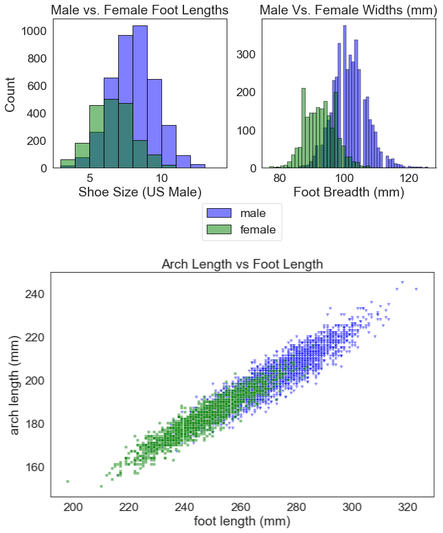
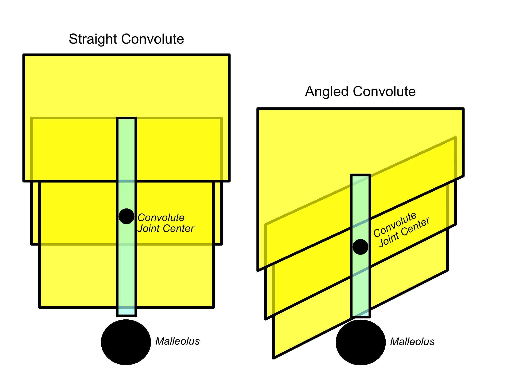
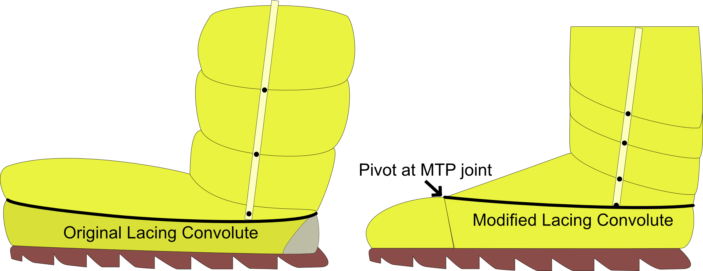

# Specific Aim 3: Define a design process integrating dynamic foot morphology data for a novel spacesuit boot 

## Introduction

Previously designed planetary spacesuit boots have modified terrestrial hiking boots and integrated a pressure bladder to be pressurized. 
These boots were designed through iteration and subjective feedback. 
To date, these designs have failed to solve the heel-lift problem, necessitating a new approach to boot design.

The design for any new spacesuit component should aim to match the required operator motions for the intended actions, as well as be sized for the intended population. 
This allows for the component to provide proper fit and mobility to the wearer, but designing such a segment requires an understanding of body segment size and mobility.
Combining the novel dynamic foot morphology model with known foot shape and mobility characteristics provides the necessary information to better fit the spacesuit boot to the foot. 
However, there does not exist a defined process for integrating all available data to drive spacesuit component design with a focus on improved fit and mobility. 
This objective aims to define that process specifically for the spacesuit boot, through the following objectives:

- Literature review of existing foot shape and mobility knowledge
- Development of a design framework to design a more compatible spacesuit boot
- Design and construction of a spacesuit boot prototype leveraging the design framework

## Existing Knowledge on Foot Shape Mobility

The foot's static shape distribution and mobility have been well characterized through previous analyses [@Farris2019; @Mann1979; @Voloshina2013; @Wannop2014]. 
The following sections describe each of these specific foot measures and provide their population-derived nominal values. 
[Figure @fig:SA3-Foot] highlights these foot-specific measures.

{#fig:SA3-Foot width="40%"}

### Linear Anthropometry

The ANSUR II survey collected a number of foot-related measures which can be analyzed to provide a baseline for foot shapes and sizes[@Gordon2014]. 
Three of these measures are directly related to fit and mobility. 
Foot length and foot width define the outer bounds of the foot shape. 
Foot length and width are directly correlated to US shoe sizes for both width and length. 
Since females generally feature smaller feet than males, female shoe size is typically 1.5 units less than the calculated male size. 
[Figure @fig:SA3-ANSUR] shows that this offset does not sufficiently align the female population to the male population. 
Therefore, it is important to use foot length as a direct measure when fitting or selecting a shoe as opposed to shoe size.

Arch length denotes the location of the metatarsophalangeal (MTP) joints on the foot, one of the important joints during gait. 
Since power is transmitted through the MTP joints, the alignment of the MTP joints with the ball of the shoe is important to ensure power is properly transmitted during heel-off. 
Therefore, the arch length measurement is correlated to standard shoe sizes and if larger, will be selected over the length measurement. 
[Figure @fig:SA3-ANSUR] shows that while arch length is correlated to foot length for both males and females, there is still high variability in this relationship. 
Therefore, arch length is an important measure to consider to ensure proper indexing and dynamic fit between the wearer and spacesuit boot. 

{#fig:SA3-ANSUR width="80%"}

###  Gait Joint Kinematics

The foot’s main function during gait is to transmit power against the ground, ensuring that the human pushes off and initiates a step. 
During each step, the ankle pushes off from the ground to initiate a step.
Intrinsic foot muscles help stiffen the foot to assist the push-off from the ankle against the ground [@Farris2019]. 
The MTP joint not only exhibits flexion in the sagittal plane, but provides the necessary stiffness to allow for the ankle power to translate into push off [@Stefanyshyn1997]. 
Ankle joint rotation may also help balance and stability during gait, particularly on slopes [@Wannop2014]. Neither the ankle joint nor the MTP joint should be restricted in its movement to enable efficient push-off and stability. 
However, free movement of the ankle joint can increase the risk of injury from instability caused by external forces from walking on an uneven surface. 
Therefore, there is a balance to be struck between allowing for movement while preventing potentially injurious movements.  

Nominal values for the foot MTP and ankle joint movement during gait can be derived from the numerous studies conducted on human gait. 
Voloshina et al. [@Voloshina2013] found that during gait on uneven surfaces, the ankle does not flex past +/- 20 degrees. 
Wannop et al. [@Wannop2014] reported  peak foot-floor angles which suggest that on level and sloped surfaces, subjects dorsiflex their ankle up to 40 degrees, and flex their MTP joint up to 60 degrees. 
The MTP joint has been shown to flex between 70-90 degrees during gait [@Mann1979]. 
There is very little ability of the MTP joint to extend or move in the frontal or transverse plane [@Mann1979]; therefore these motions may want to be limited in the boot's design to prevent injury. 

The ankle joint exhibits most of its movement in the sagittal plane. 
However, the ankle joint can perform inversion/eversion in the frontal plane and internal/external rotation in the transverse plane. 
Wannop et al. [@Wannop2014] found that subjects wearing a low-top shoe with no additional ankle stability had up to 10 degrees eversion and 15 degrees inversion while navigating a slope.
However, excessive inversion/eversion may decrease stability and lead to injury. 
During gait, the human normally exerts energy to stabilize their ankle in this direction [@OLoughlin2009]. 
However, any external force can destabilize the ankle, as commonly seen in basketball or hiking [@Bohm2010]. 
Therefore, it will be desired that any boot stabilizes the ankle in this motion. 
In addition, freedom in the transverse plane is desired to allow for positioning of the foot when navigating an uneven surface, aiding in balance [@Wannop2014;@Fraser2016a]. 
Wannop et al. [@Wannop2014] found the ankle internally/externally rotates +15/-20 degrees on a slope.

## Biomechanical Boot Design Framework

The proposed design framework will link foot measurements described in the previous section and the dynamic foot shape model to specific footwear design variables, allowing for the design of a spacesuit boot with proper fit and mobility. 
The framework assumes the development of a gas-pressurized spacesuit boot to maintain compatibility with the current xEMU architecture. 
Since gas pressurized spacesuits are stiff when pressurized, they require specially designed joints which allow for flexibility of the stiff structure. 
The gas pressurized layer does not have the ability to stretch once pressurized, and therefore must be sized specifically to fit the population range. 

Footwear design variables are categorized as either population measures or individual measures. 
Population design variables are used in the general design and selections of materials for the shoe, which will accommodate the range of foot shapes and motions seen by the population. 
Individual design variables will be sizing specific elements which are changed between sets of boots to fit inter-individual differences (such as shoe size). 
Foot mobility measures are used to define the range-of-motion of the boot's joints. 
Foot shape measures can be used to shape the upper and sole of the boot, aiming to accommodate the foot shape inside.
Sizing variables such as foot length, foot width, and arch length, are used to influence the size of the components developed from foot mobility and foot shape measures. 
[Figure @fig:SA3-Overview] shows how each of these measures is mapped to footwear design variables. 

{#fig:SA3-Overview width="90%"}

### Mobility

Footwear is flexible at the MTP and ankle joints to allow for effective push-off during gait. Terrestrial footwear normally derives flexibility from the materials used for that portion of the shoe; the shoe is typically made of softer materials or less reinforcement at the joints. Since altering materials property stiffness is not an option for spacesuit design, rolling convolute or toroidal joints could be used in the spacesuit footwear to allow for flexibility at the MTP and ankle joints [@Harris2001]. [@fig:SA3-Mobility] shows the desired flexibility based on foot-specific measures. These population measures will ensure that the boot provides enough flexion to not constrict natural motion. 

The MTP joint should target flexion of +90 degrees and the ankle joint should target dorsiflexion/plantarflexion of +40/-20 degrees. 
Due to the potential for unstable terrain, a high top style footwear is suggested to stabilize the ankle, similar to a hiking or military style boot. 
However, it has been shown that a very stiff boot reduces ankle ROM and decreases stability at the knee joint [@Bohm2010], potentially leading to ankle and knee fatigue.
By allowing for a internal/external rotation of +15/-20 degrees, and inversion/eversion of +15/-10 degrees, the boot still allows the foot to navigate a sloped and uneven surface without fatigue.
The relatively low amount of movement will still allow the ankle to be stabilized and lower the risk of injury.

The only requirements previously stated for boot mobility are in the 2019 NASA SBIR Surface Space Suit Boot Solicitation [@NASA2019].
The solicitation matches the +40/-20 degrees ankle dorsiflexion/plantarflexion requirement, but presents no requirements for ankle internal/external rotation, inversion/eversion, or MTP joint flexion. 
The proposed design framework targets higher flexion/extension capability in the ankle joint, as well as specifies extension of the MTP joint, limited ankle internal/external rotation, and limited ankle inversion/eversion.

{#fig:SA3-Mobility width="60%"}

### Toe box

The toe box accommodates the foot forward of the MTP joint. 
The toes provide the contact for power from the MTP and ankle joints to push off the ground during each step. 
Therefore, the most important feature of the toe box is contact between the toes and the ground during heel-off. 
As a result, the toe box can feature more space around the top of the toes for comfort [@Luximon2009]. 
Since the toe box does not need to provide any additional flexibility, it can be constructed with a less flexible material to allow for adequate support of the boot and foot. 
In conjunction with the MTP joint, the toe box should also be adjustable such that it can match the arch length of the wearer, allowing for proper fit and indexing of the MTP joint. 

### Upper

The dorsum of the foot is covered by a shoe upper.
The shape of the upper needs to conform to the shape of the dorsum to allow for proper driving of the shoe during any activity [@Feeney2019]. 
Foot shape data taken from a large population will be useful in defining an ideal upper shape that fits a range of persons. 
The boot upper will also have to conform to the foot shape without causing discomfort during movement. 
Dynamic foot shape data can quantify how dorsum shape is changing throughout the gait cycle, allowing for the upper to accommodate any expansion or contraction of the dorsum shape for optimal comfort and support. 
The instep height measurement is of particular importance, as it represents the height of the foot from the plantar surface to the dorsal surface just in front of the ankle joint. 
The instep height measurement was found to have both static and dynamic variability from the dynamic foot shape model in Chapter 5. 
Therefore, the upper should accommodate this variability to ensure fit can be maintained through the gait cycle for a wide range of static instep heights. 

Lacing or other closure mechanisms can assist the upper in conforming to and capturing the foot, 
Closure mechanisms allow for customization by the individual wearing the boot, so each wearer can adjust the boot to their preferred fit. 
Conforming the upper to the foot will also eliminate any empty space between the foot and above the dorsum, reducing the chance of heel-lift since the foot will no longer be allowed to move within the boot. 
In addition, this reduces the chance of contact injuries from rubbing between the foot and boot. 

The upper and lacing will also play a role in donning and doffing of the spacesuit boot.
Traditional boots feature laces along the upper which secure the foot inside the boot during activity, but loosen to allow the foot to slip into and out of the boot. 
The closure will need to be designed in conjunction with pressure bladder, as the pressure bladder will need to deform in a structured matter when the laces are tightened.
The boot can then loosen and allow the foot to be removed.  

The upper’s location between the MTP and ankle joint, and its requirement to conform to the shape of the foot, may drive the selection of a softer, flexible fabric being used to meet these requirements. 
This presents a challenge with designing the pressure bladder, as the pressure bladder is inherently stiff under pressure. 
Therefore, a soft inner layer above the dorsum may be used which allows the stiff pressurized bladder to conform to the individual’s dorsum. 
Since the dorsum still transmits power to push the shoe off the ground, the soft layer still needs to have enough structure to transmit this power. 
If too soft, the layer will simply act as empty space and the shoe will not respond to ankle flexion during heel-off, potentially resulting in heel-lift. 

### Sole

The sole in a traditional boot provides traction, support, and protection to the wearer.
The sole needs some thickness to accommodate tread for grip on uneven surfaces. 
In general, the thicker a sole, the stiffer it becomes. 
As a stiff sole resists bending, it might fight against the motion of the foot and shoe during heel-off. 
Therefore, the sole needs to be flexible during heel-off without imparting additional forces on the shoe and upper. 
Dobson et al. [@Dobson2020] found that having a fully flexible sole in coal miner’s boots inhibited the natural roll-off of the foot during gait, resulting in less comfort. 
However, it was not verified if the boot’s flexibility at the MTP joint aligned well with the MTP joint, since sole flexibility was done simply by cutting into the sole near the MTP joints. 
Therefore, it will be imperative to ensure that any flexibility at the MTP joint is either perfectly aligned with the foot, or the flexibility does not inhibit the natural roll off of the foot. 
Dynamic foot shape data can provide a base contour for the sole to be able to bend at the MTP joint during heel-off, as shown in [@fig:SA3-SoleFlex]. 
The sole should have higher flexibility near the MTP joints; doing so will allow the sole curvature to match the foot’s plantar curvature during gait.
In addition, population measures of arch length can help characterize the location of the MTP joint along the foot, ensuring that the MTP joint is properly indexed by the sole. 

{#fig:SA3-SoleFlex width="50%"}

## Prototype Planetary Spacesuit Boot Design

The biomechanical design framework was used to inform the design of a prototype planetary spacesuit boot with improved fit and comfort compared to current prototypes. 
The boot is designed to be compatible with gas pressurized spacesuits.
When a spacesuit is pressurized, it's pressure bladder expands to a stiff shape with increased volume. 
The stiff structure must be deformed by the wearer to provide mobility, as described in Chapter 2. 
In addition, this structure is the closest layer in a spacesuit assembly to the spacesuit operator, and therefore plays an important role in fit and comfort.
A spacesuit's pressure bladder is typically paired with a restraint layer to control the expansion of the bladder[@Harris2001]. 
However, through discussions with spacesuit engineers, the pressure bladder was found to be the most important layer in providing fit, comfort, and mobility. 
Therefore, the design of the prototype planetary spacesuit boot was restricted to the pressure bladder layer without an accompanying restraint layer. 

The primary goal of this design was to accommodate a wide range of instep heights, due to both static and dynamic variability as described in Chapter 5. 
Design elements from previous planetary spacesuit boot designs were implemented to meet the biomechanical and anthropometric requirements presented in the framework above. 
The following sections describe the design decisions made for various parts of the prototype planetary spacesuit boot.

### Ankle Convolutes
Current planetary spacesuit prototypes use  single-axis convolute assembly with three segments to provide ankle flexion/extension, but not inversion/eversion [@Ross2002]. 
A segment consists of a circular piece of fabric; individual segments are assembled with overlap over consecutive segments. 
While a variety of convolute joint designs are available (see Chapter 2), rolling convolutes were chosen for this boot design after prototyping efforts found these to be the most easily constructed in a laboratory setting. 
Rolling convolute joints feature a band around each convolute segment, which guide the convolute's rolling and unrolling during motion [@Harris2001].
When a rolling convolute ankle joint is flexed, one side of the convolute segments roll over each other and collapse, while the convolute segments on the opposite side unroll and expand [@fig:SA3-convolute_actuation].
A longitudinal restraint strap is attached to the convolute segments to ensure that the convolutes do not unfold completely from pressurization [@fig:SA3-convolute_actuation].
The rolling convolute joint also does not require a restraint layer to function, allowing it to be integrated within the scope of this design. 
It was decided to retain the number of convolutes from the planetary spacesuit prototypes, but recalculate the sizing and placement of the convolute segments to meet the requirements from the biomechanical boot design framework. 

{#fig:SA3-convolute_actuation width="90%"}

Range-of-mobility for a convolute assembly is limited by the number of convolute segments, height of each convolute segment, and the overlap between each segment. 
When a convolute assembly is fully actuated, its segments are fully collapsed on one side, and fully extended on the other side.
This can be simplified into a triangle, to show the extent to which the convolute assembly is bent [@fig:SA3-convolute_tri].
The width of this triangle represents the diameter of the convolute assembly.
The width and hypotenuse of the triangle are equal as the diameter of assembly is constant for each segment.
The height of this triangle is the total actuated height of the convolute assembly when it is fully expanded on one side, and collapsed on the opposite side.
A convolute assembly's expanding side can only unroll until it is no longer overlapping the preceding segment [@fig:SA3-convolute_actuation]. 
Similarly, the collapsing side of the assembly can only roll until each segment reaches the bottom of the succeeding segment. 
The vertex connecting the base and hypotenuse of the simplified triangle represents the collapsing side of the assembly. 
The simplified triangle's height represents the expansion of the assembly; as the convolute assembly has a resting height when it is not actuated, the triangle's height only represents the total overlap between all segments.

{#fig:SA3-convolute_tri width="60%"}

The total overlap of the convolute segments can therefore be determined by the diameter of the convolute assembly and the desired range-of-motion (ROM) from this triangle:
$
overlap_{total} = diameter*tan(ROM)
$
As unrolling and rolling occur simultaneously for each segment, the placement of a convolute segment should be such that its overlap with preceding and consecutive segments is half the segment height.

To determine the individual convolute segment heights, the total overlap is divided by the number of convolute segments minus one, as the total overlap is distributed across all convolute segments. 
In addition, the final convolute segment in the assembly does not have a succeeding segment to roll over. 
The height of a convolute segment should be 
Therefore, the height of a convolute segment given a desired range-of-motion (ROM) is:

$$
height = 2*\frac{diameter * tan(ROM)}{n_{segments}-1}
$$

Each convolute segment should be placed in the assembly such that it is overlapping the successive segment by one-half of its height. 

Circumferential sizing of the ankle convolute assembly was determined by the requirement of the boot to be donned and doffed over the wearer's foot, ankle, and calf. 
Of these, the heel-ankle circumference was identified as the largest dimension around which the ankle convolute assembly needs be donned/doffed over [@Gordon2014].
The 95% percentile of male heel-ankle circumference, 372 mm, was chosen as the circumference of the ankle convolutes, allowing the convolute assembly to be donned over the foot.

The corresponding diameter to a circumference of 372 mm is 184 mm ($372mm/\pi$).
As the desired dorsiflexion ROM (40 degrees) is greater than the desired plantarflexion ROM(20 degrees), this will drive the convolute height calculation. 
Using the above equation, the resulting convolute segment height is 100 mm. 

A longitudinal restraint strap is needed to ensure the convolutes do not fully expand during pressurization, and to balance the expansion and contraction of the convolutes during joint actuation. 
This restraint strap fixes the overlap of the convolute segments at the medial and lateral extents of the joint, allowing the assembly to provide plantar and dorsiflexion. 
The restraint strap should therefore be sized to the height of each convolute segment, times the number of convolute segments. 

The ankle joint convolute assembly should also be able to be actuated by the operator's ankle joint, whose joint center is at the malleolus. 
The ankle convolute segments in current planetary spacesuit boots are placed above the instep region, as their vertical height needs to be accommodated 
The joint center of the convolute system is at the center of the middle convolute segment.
For an ankle joint, this places the joint center well above the malleolus.
Therefore, the operator's ankle joint is not indexed properly within the spacesuit boot. 
Placing the convolute segments at an angle with respect to the plantar-plane of the foot allows the joint segment to be shifted downward ([@fig:SA3-convolute_ang]). 
A 25-degree tilt was applied to the convolute segments to lower the joint center such that it is closer to the malleolus, improving the indexing of the operator's ankle joint inside the boot. 

{#fig:SA3-convolute_ang width="70%"}

### Upper and Toe Box
The upper is the part of the boot ventral of the MTP-joint and above the sole. 
The toe-box refers to the part of the boot distal of the MTP-joint. 
The upper of the planetary spacesuit boot prototype should allow the foot to drive the motion of the shoe while providing proper fit and comfort, while the toe-box simply accommodates the toes. 
Shoe uppers are based on a last: a mold representing the foot shape around which the shoe is constructed.
A last is characterized by its heel-to-toe drop and toe-spring, two sole design features which are very specific to the application of the shoe.
As a planetary spacesuit boot is tasked with allowing an astronaut to work and ambulate comfortably across a rough and unknown terrain, parameters from a hiking boot can be used to select a last. 
A male size-9 hiking last was provided for this project from the University of Oregon Sports Product Design Program.
This last features a minimal heel-to-toe drop and a toe-spring of 15 degrees.
The last features a roomy toe box, where the toe-box is larger than the volume of the toes, for comfort. 
The last was widened at the ankle to interface to a circumference of 372mm, the same dimension as the ankle convolutes. 
This allows the ankle convolute assembly to be attached to the upper.
The original last and the widening modification are shown in [@fig:SA3-lastmod].

{#fig:SA3-lastmod width="80%"}

The last was 3D printed with ABS. 
A flat pattern of the last was generated by placing masking tape over the last and cutting along seam lines as shown in [@fig:SA3-lasttape] [@Motawi2020]. 
The cut pieces are then placed on white paper to create patterns which represent the planetary spacesuit boot's upper.
These seams were chosen to ensure the patterns are as flat as possible. 
As a result, separate patterns were generated for the sole and toe box, and the upper was split into multiple patterns.  
The seam which runs along the foot's length across the upper was used to incorporate lacing into the boot. 

{#fig:SA3-lasttape width="80%"}

### Instep Lacing
Lacing in a terrestrial shoe allows for adjustment of the shoe's upper to accommodate arch height variability.
Lacing is typically paired with a tongue, which will raise or lower in height to provide the best fit and comfort to the wearer [@Feeney2019].

For lacing to behave similarly in a spacesuit boot, it must be accompanied by a pressure bladder design with a structure that when deformed by the lacing, results in a tighter fit. 
Without such a design, deforming the pressure bladder will result in folds, which have been shown to cause discomfort [@Chappell2017], and may be unpredictable in their deformation. 
A convolute can be used to control the deformation; as the lacing is tightened, it can contract the convolute in a prescribed fashion which will cause the distance between the plantar and dorsal surface of the shoe's interior to decrease and result in a tighter fit. 
When the lacing is loosened, the convolute is expanded and the volume is increased, resulting in a looser fit. 

Initial designs of the lacing convolute had the convolute placed around the entire foot [@fig:SA3-lacingevo]. 
Thus, when the convolute is contracted, the distance between the plantar and dorsal surface decreases uniformly across the length of the foot. 
However, findings from the dynamic foot shape model (See Chapter 5) found that instep height variability mostly occurs towards the ankle joint. 
Therefore, the lacing convolute design was modified to pivot at the MTP joint. 
The lacing convolute is designed into the seam between the inferior and superior upper patterns.
The overlap for the lacing convolute was designed with a varying height across the length of the upper patterns, as opposed to the constant height of the overlap used for the ankle convolutes.
The overlap is 1 cm at the toe-box, and 5 cm near the heel, allowing for the pivot at the MTP joint. 

{#fig:SA3-lacingevo width="70%"}

The convolute is paired with a lacing system to allow the wearer to adjust the fit of the upper to their desired tightness ([fig:SA3-lacingoverview]).
In a spacesuit boot, the lacing will need to withstand the pressure forces; the pressure forces will want to expand the boot and loosen the lacing.
A BOA lacing system (BOA, Denver CO) was chosen for its strength and fine adjustment, and was graciously provided by BOA. 
The BOA H4 system consists of a dial, a steel lace, tubing, and low-friction guides; this is the strongest system provided by BOA.
The guides are attached in an alternating pattern between the top and bottom layers of the convolute.
The lace is run from the dial, through the tubing on the medial side, through the guides, and back through the tubing on the lateral side to the dial.
As the dial is tightened, the lacing length is decreased, bringing the guides closer together and contracting the convolute. 
The lace length is kept constant through the tubing, which fixes the length between the dial and the guides.
This is necessary to ensure that no tightening is occurring near the ankle convolute assembly, which would prevent the ankle convolutes from working. 
Once the lace is tightened to the desired level, the dial can be locked; this prevents the lace from lengthening or shortening. 

The placement of the dial was chosen to provide dynamic tightening ([fig:SA3-lacingoverview]).
The dial is placed on the front of the convolute assembly. 
The tubing is run on the distal side of the convolute assembly. 
Therefore, when the ankle is plantarflexed, such as during heel-off, the distance that the lace travels increases.
Since the lace length is locked, the guides must move closer together to accommodate the lace travel length; this therefore rolls the convolute and tightens the fit. 
The dynamic tightening accommodates the drop in instep height characterized in the dynamic foot shape model (Chapter 5), ensuring that fit is maintained throughout the gait cycle. 

{#fig:SA3-lacingoverview width="70%"}

### Heel Counter
The heel counter is used in footwear to provide a stiffer rear foot support [@Van1995], which may prevent the rear of the shoe from deforming and allowing the heel to lift out of the shoe. 
The placement of the rearmost BOA dial ([@fig:SA3-lacingoverview]) acts as a heel counter, as it is designed to sit above the heel. 
An additional heel counter was secured to the inside of the pressure bladder beneath the rearmost BOA dial.
The thickness of the polymer heel counter was determined through iterative testing; polymer thickness was increased until it interfered with donning and doffing. 

### Sole
The sole of the boot provides support, traction, and protection to the wearer.
As the prototype spacesuit boot will only be constructed for laboratory testing, a simple sole was constructed to represent the height that a manufactured sole would have. 
A sole was designed by our collaborators at the University of Oregon Sports Product Design Program to fit the last used for the prototype spacesuit boot design. 
A 3D model of the sole is shown in [@fig:SA3-solemold].

{#fig:SA3-solemold width="70%"}

## Novel Planetary Spacesuit Boot Construction
The design of the novel planetary spacesuit boot was constructed into a prototype spacesuit boot with a pressure bladder and sole ([@fig:SA3-proto_boot]).
A heat-sealable urethane coated nylon (Seattle Fabrics, Seattle WA) was used as the material for the pressure bladder [@Harris2001].
Discussions with spacesuit engineers suggested 400 Denier nylon for its strength.  
The material can be made air-tight by heat-sealing with a mini-iron (Clover Needlecraft, Los Angeles CA) which can reach a maximum of 580 degrees Fahrenheit. 
Trial and error found that applying the iron at a temperature as low as 390 degrees Fahrenheit resulted in a strong bond after 20 seconds of heat application. 
As only one side of the material is coated in urethane, and the urethane can only be bonded to another layer of urethane, care must be taken in the patterning to ensure that each panel is sealable. 
It was decided that the urethane-coated side of the patterns will be facing towards the foot, as it is done in current spacesuit construction. 
Panels were sealed together with another strip of pressure bladder material ([@fig:SA3-seam]).
This technique was applied to each section of the pressure bladder, with specific details regarding construction below. 

{#fig:SA3-seam width="70%}

{#fig:SA3-proto_boot width="70%"}

### Ankle Convolute Construction
Ankle convolute construction starts with a flat panel for each convolute segment, as summarized in [@fig:SA3-convoluteflat].
The convolute assembly was constructed by folding over the top of the convolute segments for the two convolute segments with a 50mm overlap. 
This results in a convolute segment height of 100mm. 
Then, the bottom of the preceding convolute segment is sewn to the folded-over top of the succeeding convolute segment using a straight stitch at 1.0 mm pitch, at both the overlap itself and 1 cm above the overlap. 
The stitches are then heat-sealed. 
This process is repeated for the next convolute segment. 

A restraint strap is constructed from a 3/4" in canvas fabric which is folded in half and stitched on one side. 
The restraint strap's total height is 200mm. 
Two restraint straps are used for each convolute assembly, and are placed at 25% and 75% of the flat panel convolute assembly's width. 
As a result, these restraint straps will be on the medial and lateral side when the convolutes are fully assembled. 
The restraint straps are stitched to the junctions between convolute segments by using a straight stitch at the overlap and 1cm above the overlap. 

{#fig:SA3-convoluteflat width="90%"}

Once all three convolute segments and the restraint straps are attached, the two ends of the segments are brought together to make the flat panel into a circular convolute assembly. 
A strip of urethane-coated nylon is then used to seal the seam on the inside. 
3D printer filament is used for the bands of the rolling convolute. 
The filament is inserted into the gap between the stitching at the convolute segment junctions. 
The filament is trimmed to length at the seam. 
A 1.5cm strip of canvas material is glued to the bottom of each convolute segment to ensure that the convolute's overlap actuates properly. 
Without this canvas strip, the succeeding convolute segment was found to expand under pressurization and prevent the preceding convolute segment from rolling over it.
The ankle convolute assembly is now ready to be attached to the upper.

### Upper and Toe-Box Construction
Patterns for the upper and toe box expected to interface with the pattern for the sole are extended by 1 cm to provide a seam to attach to the sole [@fig:SA3-cutpatterns].
This avoids having to use a strip of urethane coated nylon on the interior of these seams, which is at a sharp angle and proved difficult to manufacture. 

The patterns for the toe box are simply assembled and sealed together by using strips of urethane-coated nylon at the seams. 
Construction of the upper needs to account for the instep lacing feature. 
The inferior upper pattern is extended by the dimensions of the overlap needed for the instep lacing: 1cm near the MTP joint and 5 cm near the heel. 
The top of the overlap is folded over and the superior upper pattern is stitched to the fold. 
This is done for both the lateral and medial upper patterns. 
The lateral and medial upper patterns are attached at the heel with a strip of urethane coated nylon. 
Then, 3D printer filament is inserted into the gap between the stitches to provide structure to the convolute. 
 
{#fig:SA3-cutpatterns width="80%"}

### Sole Construction
Ethylene-Vinyl Acetate foam is a common material used for sole construction in sneakers and daily shoes. 
Collaborators at the University of Oregon Sports Product Design Program informed us that their prototyping process for most footwear involved using Smooth-On Flex Form-it 17 (Smooth-On, Macungie PA) expanding foam, which provides a similar bounce and deflection as Ethylene-Vinyl Acetate foam. 

A mold for the sole was designed to allow for casting from the expanding foam. 
The sole was provided as a 3D mesh file ([@fig:SA3-solemold]). 
A negative of the sole was created using the Blender software, where a rectangular box mesh which was bigger than the sole was placed over it and the difference between the two meshes was taken. 
A seam was added to this box so that it can be separated into two halve. 
Three holes were placed in the top half of the box above the centerline of the sole negative, allowing for the foam to be poured in before it cures. 
In addition, four holes were placed at the corners of the box, allowing the box to be clamped together with bolts and thus sealing the mold. 
This mold was then 3D-printed out of PLA material, and is shown in [@fig:SA3-solemoldhalves].

{#fig:SA3-solemoldhalves width="70%"}

Ease Release 2831 (Smooth-On, Macungie PA) was applied to the 3D mold. 
The expanding foam was mixed, poured into the mold, and allowed to fully cure as per the manufacturer's instructions. 
The mold was then unclamped, and the sole was peeled out of the mold. 
Any flash, excess material from the molding process, was then cut off with a knife. 

The pressure bladder is attached to the sole through a welting process. 
The seam from the attachment of the pressure bladder's upper and sole patterns is sewn to the sole. 
This process is reinforced with hot glue. 

### BOA Lacing Integration
The BOA lacing guides are secured to the pressure bladder and sole through stitching. 
The guides are first perforated with four holes, and then hand stitched to the pressure bladder and sole. 
The BOA lacing dial is glued to the top of the upper most convolute segment. 
The lace tubing is press-fit into the dial and the first set of guides.
The lace tubing is also glued to the canvas straps at the bottom of upper-most convolute segment to ensure it stays secure. 

### Heel Counter
The heel counter made by casting a thin (3 mm) layer of Elite Double 16 dental polymer (Zhermack SpA, Badia Polesine (RO), Italy).
This layer was trimmed to size to fit on the interior of the boot beneath the lacing convolute. 
The heel counter was secured to the interior of the boot with hot glue and tape. 

### Pressure Sealing
While the urethane-coated nylon has an air-tight seam when heat-sealed properly, manufacturing tolerances and wear from use of the boot were found to create leak paths in the prototype spacesuit boot's pressure bladder. 
It was found that hot glue was an adequate sealant for the pressures used in testing. 
Therefore, a thin layer of hot glue was applied to all seams in the pressure bladder.

## Classic Spacesuit Boot Design and Construction
A "classic" spacesuit boot representing the current planetary spacesuit boot prototypes was also constructed ([@fig:SA3-classic_boot]).
Similar construction techniques were used as the prototype planetary spacesuit boot: the same sole was used for both boots, and the upper for both boots was designed around the same last.
The convolutes for the classic spacesuit boot were constructed with the same height, overlap, and restraint strap, but the convolutes were left flat to the foot's plantar surface, as they are in current planetary spacesuit boot prototypes [@Ross2002]. 
The upper for the classic spacesuit boot does not have any lacing; the superior and anterior upper patterns were sealed at the seam separating them. 
Some current planetary spacesuit boot prototypes, such as the one provided by David Clark, do have lacing features, but it is not clear how this lacing 
This ensure that the two boots are identical except for the three novel features in the prototype boot: angled ankle convolutes, lacing, and a heel counter. 

{#fig:SA3-classic_boot width="70%"}

##  Summary

This analysis outlined a framework for designing a new spacesuit boot with an emphasis on fit and mobility during gait. 
The framework aims to reduce the risk of spacesuit boot injury by developing a process to design a spacesuit boot. 
It is expected that focusing a design on fit and mobility will reduce the occurrence of heel-lift and contact injuries. 

This framework therefore serves as bounding requirements to ensure future spacesuit footwear does not inhibit natural foot motion or cause discomfort due to incompatibilities between foot and shoe shape. 
The only previously bounding requirement, the 2019 NASA SBIR solicitation for a new surface spacesuit boot, had only one requirement for ankle flexion/extension, which was validated in this paper.
There were no requirements other ankle motions or MTP join motions, and no requirement for proper static and dynamic fit to the wearer’s foot.
This work provides a series of requirements based from previous biomechanics studies on foot motion while walking and hiking to provide proper fit and mobility through the spacesuit boot design. 

These requirements, along with findings from the dynamic foot shape model in Chapter 5, were translated into a prototype spacesuit boot design. 
This design features a novel lacing feature which accommodates the static and dynamic variability in instep height. 
In addition, the prototype boot also features a heel counter, which should assist in ensuring the heel does not slip out of the boot during walking.
The prototype boot modifies the ankle convolutes found in current planetary spacesuit boots by tilting their plane towards the heel, thus lowering the joint center to be better indexed with the operator's ankle joint. 

The prototype boot was constructed using an urethane coated nylon for the pressure bladder.
A sole constructed from expanding foam was integrated into the design. 
Lacing for the prototype boot was provided by BOA. 

A classic planetary spacesuit boot was also constructed, but omitted the novel features of the prototype spacesuit boot.
No lacing or heel counter was included in the classic spacesuit boot. 
Ankle convolutes were left parallel to the plantar surface. 
However, this boot was constructed using the same last, resulting in similarly shaped patterns. 
In addition, the sole used for this boot is identical.

This ensures that the novel features of the prototype spacesuit boot can be compared to the classic spacesuit boot through evaluation. 
This evaluation will be carried out in Chapter 7. 

