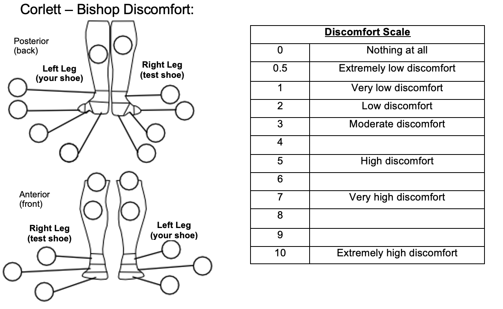

# Specific Aim 4: Evaluate novel planetary spacesuit boot design for fit and comfort {#sec:SA4}

The novel pressurized spacesuit boot prototype developed in Specific Aim 3 was validated for fit and comfort through subject evaluation.
Results of the validation can help answer the main hypothesis of this thesis: a spacesuit boot designed with dynamic foot morphology will provide increased compatibility between the spacesuit and operator. 
In a terrestrial environment not requiring pressurized spacesuits, EVA tasks are best performed with a work boot. 
Therefore, an unpressurized laced work boot was used as the gold standard to compare the novel spacesuit boot to. 
As the novel spacesuit boot features lacing, the unpressurized work boot was compared in both laced and unlaced conditions. 
A classic pressurized spacesuit boot, not featuring any lacing, was used in the evaluations to compare the novel spacesuit prototype to current spacesuit boot technology. 
This chapter details the methods for the subject evaluation of all four boots, results, and a discussion on the results as related to each boot's performance. 

## Experimental Design

The goal of this evaluation was to assess fit and comfort of the novel spacesuit boot, as it compared to the classic spacesuit boot, unlaced work boot, and laced work boot. 
Fit was primarily assessed through heel performance, as reducing heel lift is a primary focus for planetary EVA boot design. 
Proper dynamic fit will allow for high heel performance, which would improve upon current planetary spacesuit boot efforts.
Subjects in this evaluation performed five heel-raises and a short walk for each test boot condition. 
Quantitative measurements were taken during the heel-raises, and surveys were administered after completing the evaluation for each boot. 
Therefore, this experiment aimed to answer the following hypotheses:

- The novel spacesuit boot design provides equivalent comfort compared to the laced work boot and improved comfort compared to the unlaced work boot and classic pressurized spacesuit boot
- The novel spacesuit boot design provides equivalent heel performance compared to the laced work boot and improved heel performance compared to the unlaced work boot and classic pressurized spacesuit boot

## Methods

### Subjects
Five subjects with a self-reported shoe size between 8-10 US Male (9.5-11.5 US Female) were recruited to participate in this evaluation. 
Participant foot length, foot width, and arch length were measured with a Brannock device when they arrived in the lab. 
A summary of participant foot anthropometries is provided in [table @tbl:foot_meas].  

| Subject    | Foot Length (cm) | Foot Width | Arch Length (cm) | Sex |
| -- | ---- |  ---- |  ---- | - |
| FQ | 25.5 | C | 26 | F |
| FT | 25.5 | D | 25 | F |
| RM | 25.5 | C-D | 27 | M |
| TF | 25.5 | D | 25 | M |
| TQ | 26.5 | D | 27 | M |
| Average | 25.7 $\pm$ 0.4 | |26 $\pm$ 1|

: Summary of subjects' foot measurements {#tbl:foot_meas}

### Procedures 
For each boot condition, subjects donned the test boot on their right foot. 
The order of the test boots was counterbalanced within the pressurized and unpressurized categories; subjects started their trials with the unpressurized boots and then proceeded to the pressurized boots. 
The lacing was simply removed or added when switching from the laced workboot to the unlaced workboot,and vice versa; this maintained the same boot for both these conditions minus the lacing. 
Subjects were instructed to bring their own low-top sneaker to wear on their left foot; a low-top sneaker does not limit the amount of heel-rise when compared to a high-top shoe, and therefore serves as a control between all test boot conditions.  

Subjects started by performing one set of five heel-raises, and were instructed to best synchronize their heel-raises between both feet. 
They were also instructed to lift each foot independently as high as possible. 
Subjects were monitored during their performance of the heel-raises, and asked to repeat the heel-rise set if they were not able to maintain balance during the heel-raises, or were not synchronized when initiating the heel-rise.
After performing the heel-raises, subjects were then instructed to walk a distance of 4 meters. 
This distance was limited by the length of supply air line available to pressurize the spacesuit boots. 

### Quantitative Measures

Each of the test boots had two markers placed on their medial side. 
The first marker was placed on the sole in-line with where the center of the shank would lie in the boot. 
The second marker was placed on the sole 10 cm forward of the first marker. 
Silver retro-reflective tape was used as the markers for the work boot as it provided the greatest contrast against the black sole. 
Black Duck tape was used for the spacesuit boots for contrast against the white sole.
Markers were similarly placed on the subjects' left shoe, choosing a color which provided the greatest contrast against their shoes. 

For the heel-raises, subjects were instructed to stand centered between two Intel RealSense D415 cameras. 
These cameras were used to collect video data of the markers' movement for both the left (control shoe) and right (test shoe) sides [@fig:SA4-Kinovea].
Kinovea software was used to measure the vertical amount of heel-rise with these markers. 
For each heel-rise set, the distance between the two markers is used to calibrate the video data from the camera's coordinates to the global coordinates. 
The horizontal axis was defined as the plane of the floor. 
The Kinovea software tracked the vertical displacement of the first marker to assess heel-rise magnitude with respect to the floor to measure the heel position over time in the vertical plane. 

{#fig:SA4-Kinovea width="80%"}

Findings from [Chapter @sec:SA1] showed that IMUs may not be appropriate for detecting instances of heel-lift and characterizing heel performance.
Therefore, a force sensitive resistor (FSR 402, Interlink Electronics, Camarillo CA) was embedded in the sole of the test boots [@fig:SA4-FSRembed]. 
The FSR was attached to a Raspberry Pi Pico, which measured the voltage across the sensor with a voltage divider. 
The FSR was supplied with a 3.3V reference voltage. 
As a force is applied to the FSR, the resistance of the FSR decreases.
To align the sign of the FSR voltage to the sign of the heel rise magnitude, the voltage reading was inverted such that applying force to the FSR decreased the voltage.

{#fig:SA4-FSRembed width="50%"}

Post-hoc calibration of the FSRs was conducted to characterize the voltage response to force. 
Calibration was conducted by applying a force from a instrumented force gauge to the sensors, while they were still embedded in the boot. 
The voltage response of the FSR and the force gauge's output were synced with a custom Python script. 
Due to sensor breakage, the sensor in the novel spacesuit boot for subjects FT and TF was not calibrated, as it was replaced prior to being used by the other subjects. 
Calibration results [@fig:SA4-FSRcal] showed a similar voltage response for both spacesuit boots, while the work boot's voltage response appears shifted. 
This may be due to the softer material sole used in the spacesuit boots compared to the work boot. 
In addition, there was little confidence that the calibration curve is completely representative of a foot on the sensor, as the foot may shift while maintaining contact and this could not be accurately characterized by a single sensor. 
Therefore, as voltage is the only reliable measurement to obtain from the FSRs, it was decided to continue reporting FSR voltage as a proxy for heel contact. 
For all boots, there is a strong inflection point in the response at 0.5V, where voltages below 0.5V covered a wide range of applied force. 
It was decided to characterize a voltage of 3.3V as "no contact", voltages between 0.5 and 3.3 V as "mild contact", and voltages below 0.5V as "full contact". 

{#fig:SA4-FSRcal width="100%"}

A Python script was written to sync the FSR and video data, collecting frames from both cameras and the FSR voltage at the same time. 
The internal pressure of both spacesuit boots was also logged from the manometer and collected with the FSR and video data, but the reading of the manometer was only updated about once a second. 
Computational power limited the sample rate of the FSR and video data to 14 Hz. 
While this is much lower than typical biomechanics sample rates, it is still within the frequency content of gait [@Antonsson1985].

While video and FSR data was collected during the short walk, this data was not analyzed due to the video's limited field-of-view, thus only capturing one step in each walk. 

### Survey Measures

After completion of the exercises in each boot, subjects filled out a survey assessing heel performance, discomfort, and exertion.
Heel performance was defined as the response of the shoe to the subject's heel. 
Heel performance was assessed by asking the subject to score the boots' heel performance on a ranking from 1 (low) to 10 (high).
Low heel performance was described as analogous to a flip-flop, where the shoe does not lift when the heel is lifted and there is high heel-lift. 
High heel performance was described as analogous to a well fitted sneaker, where the shoe instantly responds to the subjects heel being lifted and there is minimal to no heel-lift. 
The Corlett-Bishop Discomfort Scale [@Corlett1976] was used to assess subject discomfort; the survey was modified and limited to 10 areas below the knees of the subject. 
This survey asks subjects to report their discomfort from a scale of 0 (none) to 10 (extremely high) for each of the areas, shown in [figure @fig:SA4-CB]. 
The Rating of Perceived Exertion (RPE) [@Borg1982] was used to assess how much effort was required to perform the motions. 
This question asks subjects to report the amount of effort required to perform the heel-rise and walking tasks.

After performing the exercises in all four boots, subjects were then asked to rank the boots from best to worst with respect to overall performance and comfort. 

{#fig:SA4-CB width="80%"}

### Quantitative Data Processing

Heel position, as measured by the Kinovea software, was used to identify heel-off initiation time and maximum heel-rise magnitude for both the left (control) and right (test) shoe for each boot condition's heel-rise set. 
For all sets, the first heel-rise was not analyzed. 
Python's ``scipy.signal.find_peaks`` peak detection algorithm was used to identify the peak heel positions for each heel-rise with a width of 5 samples. 
The left shoe was lifted higher in all heel-raise compared to the right shoe, necessitating differing peak prominence parameters for the peak detection algorithm. 
A peak prominence of 4 cm was used for the left shoe compared to a peak prominence of 1.5 cm for the right shoe. 
These prominences were set by observation of the collected data.
The heel position at each peak was noted as the maximum heel-rise magnitude for each heel-rise in the set. 

Heel-off time was identified for both sides by first inverting the heel-position signal and then identifying the signal peaks with the identical parameters for each side as for the maximum heel-rise magnitude analysis.
These peaks are the foot-flat phases of the heel-rise motion for each heel-rise.
Then, a moving average filter with a window size of 10 samples was applied to the heel position signal. 
The filtered signal was then integrated to obtain the heel's velocity. 
Within the foot-flat phases, a threshold of 1 cm/s, decided on after trial and error, was used to identify when a heel-rise was beginning. 
The point at which the velocity signal crossed 1 cm/s was identified as the heel-off time for that heel-rise. 

The FSR voltage was recorded at each heel-off time for the right side. 
The maximum FSR voltage obtained during each heel-rise was obtained by first applying a moving average filter with a window size of 20 samples to the FSR voltage signal. 
Then, Python's ``scipy.signal.find_peaks`` algorithm was used to identify peaks with a prominence of at least 0.5 V and a width of 5 samples. 
As the FSR signal was quite noisy at its peak, a window of 50% of the peak's width from the peak's highest value was isolated. 
The average FSR voltage in this window was then noted as the FSR peak voltage for that heel-rise. 

### Statistical Analysis
Bayesian linear regressions were modeled was used to analyze the following metrics across all four shoe conditions:

- heel performance score
- rating of perceived exertion
- left/right difference in heel-rise magnitude
- left/right difference in heel-off time
- FSR voltage at heel-off
- FSR voltage at heel-rise 

Mixed-effects linear models were used to estimate these metrics as they are affected by the various boots (fixed effects); subject specific intercepts (random effects) allows for estimation of the group-level effect while controlling for subject-specific effects. 
Subject-specific intercepts allow for the capture of subjects' internal calibration of surveys, or their individual performance of the heel-rises irregardless of the footwear they are wearing. 
Each model used in this analysis is of the form: 
$$
metric = \beta_{\text{shoe}}x_{i}+\alpha_{subject}^{n}+\sigma
$$
where $\beta_{\text{shoe}}$ is the effect of each footwear ($x_{i}$) on the metric, $\alpha_{O}$ are the $n$ subject-specific intercepts, and $\sigma$ is the unexplained error of the model. 
Since the shoe types are categorical, $\beta_{\text{shoe}}x_{i}$ can be expanded:
$$
metric = \beta_{\text{Novel Spaceboot}}+\beta_{\text{Laced Workboot}}+\beta_{\text{Classic Spaceboot}}+\beta_{\text{Unlaced Workboot}}+\alpha_{subject}^{n}+\sigma
$$

The model for each of the metric therefore consisted of an estimate of the effect of each footwear and subject specific intercepts for each subject.
Bayesian inference was used to estimate the parameters of the mixed effects models as a interval of its likely values. 
This is done by starting with a prior, defining the model, and sampling from the posterior distribution to obtain each parameter's posterior distribution. 
This distribution was then presented as the estimate of the parameter's value. 
The Bambi Python package [@Capretto2020] was used for this analysis. 

Bayesian inference starts with the selection of a prior for each of the predictors. 
The priors for the heel performance score and rating of perceived exertion were selected to be a uniform distribution with lower and upper bounds set by the limits of the survey scales. 
This reflects our knowledge that survey scores cannot exceed the bounds of the survey rating. 
Similarly, a uniform prior with a lower bound of 0 and an upper bound of 3.3 was used for the FSR voltage metrics, as the FSR voltage is always positive and has a maximum of 3.3 V. 

There exists no previous work which can directly inform the prior for heel-rise difference and the differences in heel-off time, as affected by various footwear. 
Therefore, weakly informative priors with wide standard deviations were used as the priors due to our limited knowledge of the specific metric. 
Previous work has shown that barefoot humans can lift their heels an average of 12 cm [@Brorsson2017]. 
Therefore, the prior for heel-rise difference was set to a Normal distribution with a mean of 0, and a standard deviation of 12. 
This reflects an expected maximal heel-rise difference of a normal heel-rise on one side, while the other side stays on the ground. 
A normal distribution with a mean of 0 and a standard deviation of 1 was chosen as the prior for difference in heel-off time, as it was not expected that the time to complete one step would be more than 1 seconds. 

Priors for the subject specific intercepts and unexplained error were left for Bambi to automatically select [@Capretto2020]. 
Once priors are chosen and the model is specified, the model is fit using a Markov Chain Monte Carlo (MCMC) method to sample from the posterior, as impelemnted in the PyMC3 Python library [@Salvatier2016].
Ten parallel MCMC chains were run for each metric's regression, with 6,000 burn-in draws and 12,000 sampling draws per chain. 
The acceptance target was set to 0.99 to reduce the step size within each iteration, and thereby eliminating divergences from the chain. 

The maximal posterior estimate and 95% Bayesian credible interval were calculated from the sampled posterior distribution for each parameter in each model. 
The posterior distributions for each of the shoe condition parameters were then compared to the novel spaceboot's posterior distribution to assess their comparative performance, presenting the chance of the compared shoe condition resulting in a higher or lower metric response compared to the novel spacesuit boot. 

## Results 

Four out of the five subjects ranked the shoe conditions from best to worst as Laced Workboot, Novel Spaceboot, Unlaced Workboot, Classic Spaceboot. 
The remaining subject's ranking switched the order of the Novel Spaceboot and Unlaced Workboot. 
The mean and maximum Corlett-Bishop Discomfort ratings across all subjects for each shoe condition are presented in [figure @fig:SA4-CBresults]. 

{#fig:SA4-CBresults width="80%"}

The maximal posterior estimate of the heel performance rating for the novel spaceboot was 6.8, compared to 8.4 for the laced workboot, 2.3 for the classic spaceboot, and 2.4 for the unlaced spaceboot ([@fig:SA4-HPE]). 
The posterior distribution of the laced workboot's heel performance rating was estimated to be higher than the novel spaceboot's 98.6% of the time, while the posterior distributions of the classic spaceboot's and unlaced workboot's heel performance ratings were estimated to be lower 100% of the time. 

{#fig:SA4-HPE width="80%"}

The maximal posterior estimate of RPE for the novel spaceboot was 12.0, compared to 8.8 for the laced workboot, 14.3 for the classic spaceboot, and 8.4 for the unlaced workboot ([@fig:SA4-RPE]). 
The posterior distributions for laced and unlaced workboots' RPE were estimated to be lower than the novel spaceboot's 98% and 99% of the time, respectively. 
The posterior distribution for the classic spacesuit boot's RPE was estimated to be higher than the novel spaceboot's 94.3% of the time. 

{#fig:SA4-RPE width="80%"}

[Figure @fig:SA4-exSet] shows an example FSR response and heel-rise measurement from a subject's heel-rise set. 

{#fig:SA4-exSet width="80%"}

The maximal posterior estimate of the difference in heel-rise magnitude was 3.3 cm for the novel spaceboot, compared to 3.8 cm for the laced workboot, 5.5 cm for the classic spaceboot, and 4.8 cm for the unlaced workboot ([@fig:SA4-HLD]). 
The posterior distribution for laced workboot's heel lift difference was estimated to be higher than the novel spaceboot's 86.3%  of the time. 
The posterior distributions for the classic spacesuit boot's and unlaced spacesuit boot's heel lift difference were estimated to be higher than the novel spaceboot's 100% of the time. 

{#fig:SA4-HLD width="80%"}

The maximal posterior estimate of the difference in heel-off time was 0.0s for the novel spaceboot, compared to -0.3 s for the laced workboot, -0.5 s for the classic spaceboot, and -0.3 s for the unlaced workboot ([@fig:SA4-HOT]). 
The posterior distribution for laced workboot's, classic spacesuit boot's, and unlaced workboot's heel-off time difference was estimated to be lower than the novel spaceboot's 100% of the time. 

{#fig:SA4-HOT width="80%"}

The maximal posterior estimate of the FSR voltage at maximum heel-rise was 2.2 V for the novel spaceboot, compared to 3.3 V for the laced workboot, the classic spaceboot, and the unlaced workboot ([@fig:SA4-FSRmax]). 
The posterior distribution for laced workboot's, classic spacesuit boot's, and unlaced workboot's heel-off time difference was estimated to be higher than the novel spaceboot's 100% of the time. 

{#fig:SA4-FSRmax width="80%"}

The maximal posterior estimate of the FSR voltage at heel-off for the novel spaceboot was 1.6 V, compared to 1.0 V for the laced workboot, 3.0 V for the classic spaceboot, and 2.3 V for the unlaced spaceboot ([@fig:SA4-FSRH0]).
The posterior distribution of the laced workboot's FSR voltage at heel-off was estimated to be lower than the novel spaceboot's 97% of the time, while the posterior distributions of the classic spaceboot's and unlaced workboot's FSR voltage at heel-off were estimated to be higher 100% and 98.6% of the time, respectively. 

{#fig:SA4-FSRH0 width="80%"}

## Discussion 

This study aimed to evaluate the performance of the novel spacesuit boot design against a laced workboot, unlaced workboot, and classic spacesuit boot design. 
Fit and comfort were the primary focus of this evaluation, with specific metrics chosen to evaluate the heel's dynamic fit in the boot, as well as the boot's overall comfort. 
It was hypothesized that the laced workboot would perform the best of all in these metrics, following by the novel spaceboot, unlaced workboot, and classic spaceboot. 
Most subjects subjectively ranked the boots in the same order as the hypothesis, except for one subject.

Select metrics from this study were further analyzed using Bayesian inference for linear mixed models to objectively assess the boots' performance. 
The linear mixed modeling approach allowed for capture of subject specific effects as random intercepts in the model. 
This was especially apparent for the heel-rise magnitude metric. 
Subject TF had much higher heel-rise magnitude across all boot conditions when compared to other subjects, and this subject-specific effect was captured in subject TF's random intercept and the credible intervals for the metric take into account performance within each subject. 
While the credible intervals may look like they overlap even if their chance of being greater or less than is close to 100%, observing the data points of each subject shows trends substantiated by the posterior distribution overlap for all metrics. 

Comfort and exertion are key metrics in assessing the performance of a spacesuit component [@Abercromby2012; @Chappell2017]. 
The pressurized spacesuit boots had higher levels of reported discomfort compared to the unpressurized work boots ([f@fig:SA4-CBresults]).
Similarly, the pressurized spacesuit boots had higher reported levels of exertion compared to the unpressurized workboots. 
However, the classic spacesuit boot still had a high (94.5%) chance of an increased RPE rating than the novel spacesuit boot. 
Since both boots were pressurized to a similar level, the novel spacesuit boot likely results in less exertion due to its design enabling better fit. 
The highest areas of pressure on both spacesuit boots was the calf, which may be due to the pressurization interface needing to compress the calf to maintain a seal. 
The novel spacesuit boot had reports of high discomfort at the instep, which may suggest contact between the foot and boot. 
This is most likely a result of the design of the boot, which attempts to maintain contact with the instep. 
In addition, one subject complained about discomfort from the BOA dial pressing into their calf. 
Future iteration may improve the discomfort associated with these contacts by strategically adding padding between the pressure bladder and wearer. 

The FSR voltage metrics provide insight into heel-contact at heel-off and at maximum heel-rise. 
The FSR voltages suggest that both the novel spaceboot and laced workboot maintain some contact with the heel at heel-off (between 0 and 3.3 V), compared to the unlaced workboot and classic spaceboot which are almost always offloaded (at 3.3 V).
However, the laced spacesuit boot maintains contact more often, with the majority of data points at 0 V.
In addition, the novel spaceboot appears to be the only boot which maintains contact at maximum heel-rise, as evidenced by its FSR voltage at heel-rise being lower than all other boots. 
This may be due to the interaction of the lacing and the softer sole of the novel spaceboot. 
The tension of the BOA lacing is kept constant when doffed; since the lower lacing guides are placed on the sole, the sole's motion is matched  to the foot's instep where the upper lacing guides run, ensuring that it is brought up during the heel-rise by the tension in the BOA lacing ([@fig:SA4-heelliftcap]).
This may also work in tandem with the designed dynamic lacing aspect of the novel spaceboot (see [@sec:SA3]), which lengthens the lace path of the BOA by relatively moving the tubing from the dial to the guides and requires the guides to come closer together to compensate. 
This is in contrast to the laced workboot's lacing, which does not interact with the sole and therefore has no mechanism to actively raise the sole. 
Therefore, this and other boots rely on the material properties of the boot itself and not an active tension force to raise the sole. 
Future work can expand upon these hypotheses by quantifying the magnitude of dynamic lacing lengthening and tension in the BOA system.

{#fig:SA4-heelliftcap width="60%"}

The heel-off time difference and heel-raise magnitude difference further add to the heel performance characterization by comparing the test boots against the subjects' own control shoes when performing a heel raise. 
The novel spacesuit boot had the lowest heel-off time difference between the left and right shoes, suggesting that most heel raises were initiated in tandem with the novel spacesuit boot. 
The other boots all were estimated to have a delay in their heel-off time, with their right foot taking longer to initiate heel-off.
This may be an indication of heel-lift; the foot inside may have lifted but it had not yet resulted in the boot leaving the ground. 
When assessed alongside the FSR voltage at heel-off for the unlaced workboot and classic spacesuit boot, this further corroborates the heel-lift hypothesis; if the FSR voltage measured at the boot's heel-off is high, then the foot is not making contact with the boot.
However, the laced workboot appears to have a delay at heel-off and still maintains contact with the heel, which may suggest that subjects simply have a hard time initiating heel-off. 
The classic spacesuit boot and unlaced workboot were estimated to have a higher heel-raise magnitude difference 100% of the time compared to the novel spacesuit boot. 
This suggests that these boots may either have large amounts of heel-lift (as evidenced by the FSR voltage at maximum heel raise), and/or are simply limiting the magnitude of a maximum heel raise.
The unlaced workboot has a loose tongue which may allow the foot to further lift out of the boot while performing a heel-raise, while the classic spaceboot may be limited in its mobility. 
The laced workboot had a 86.3% chance of a higher difference in heel-raise magnitude, suggesting similar or worse performance than the novel spaceboot. 

Subjects rated the novel spacesuit boot's heel performance as below that of the laced workboot, but above the classic spacesuit and unlaced workboot. 
However, the FSR data suggests that only the novel spaceboot maintains some level of contact with the heel during heel-off. 
Similarly, the heel-raise magnitude difference suggests that the novel spaceboot is the closest match to a subject's control tennis shoe in heel raise magnitude. 
Therefore, the quantitative data suggests that the novel spacesuit may be better at heel-raises than the laced workboot, classic spaceboot, and unlaced spaceboot. 

However, it is important to note that no quantitative measurements were collected during the short walk exercise, and the laced workboot may have performed better here to align with the subjective ratings of  heel performance. 

## Summary

This evaluation compared the novel spacesuit boot against a laced workboot, classic spaceboot, and unlaced workboot. 
When performing a heel-raise, both the novel spaceboot and laced workboot appear to maintain contact with the heel at heel-off. 
However, the novel spaceboot appears to maintain some contact throughout the heel-raise, and allows subjects to achieve their highest performance heel-raise. 
Survey measurements report the novel spacesuit boot having a lower heel performance than the laced spaceboot, but a higher heel performance compared to the unlaced workboot and classic spacesuit boot. 
Therefore, the hypothesis that the novel spacesuit boot provides equivalent heel performance compared to the laced workboot, and improved heel performance compared to the unlaced workboot and classic spaceboot is partially true. 
It is clear that the novel spacesuit boot is an improvement over the classic spacesuit boot and unlaced workboot, but it is unclear whether it is equivalent, better, or worse than the laced workboot as various metrics have shown all these possibilities. 

Pressurization appears to have had a greater impact on comfort than originally anticipated. 
Both the pressurized spacesuit boots had higher discomfort ratings and higher ratings of perceived exertion compared to both unpressurized workboot conditions. 
The novel spacesuit boot did have a lower rating of perceived exertion than the classic spacesuit boot. 
Therefore, the hypothesis that the novel spacesuit boot provides equivalent comfort to the laced workboot, and improved comfort compared to the classic spaceboot and unlaced workboot is partially true. 
The novel spacesuit boot is not as comfortable as the unpressurized workboots, but clearly more comfortable than the classic spaceboot. 

Results from this evaluation show that the novel spacesuit boot design is a clear improvement over the classic spacesuit boot design. 
The novel design was able to achieve much improved heel performance and require less exertion. 
This highlights the need for a lacing system and heel counter in spacesuit boots to help maintain heel indexing and reduce instances of heel-lift, leading to a level of performance closer to that of a workboot.