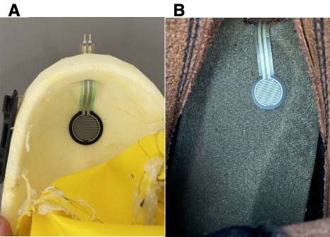

# Specific Aim 4: Evaluate novel planetary spacesuit boot design for fit and comfort

The novel pressurized spacesuit boot prototype developed in Specific Aim 3 was validated for fit and comfort through subject evaluation.
Results of the validation can help answer the main hypothesis of this thesis: a spacesuit boot designed with dynamic foot morphology will provide increased compatibility between the spacesuit and operator. 
In a terrestrial environment not requiring pressurized spacesuits, EVA tasks are best performed with a work boot. 
Therefore, an unpressurized laced work boot was used as the gold standard to compare the novel spacesuit boot to. 
As the novel spacesuit boot features lacing, the unpressurized work boot was compared in both laced and unlaced conditions. 
A classic pressurized spacesuit boot, not featuring any lacing, was used in the evaluations to compare the novel spacesuit prototype to current spacesuit boot technology. 
This chapter details the methods for the subject evaluation of all four boots, results, and a discussion on the results as related to each boot's performance. 

## Pressurization Test Interface
A pressurization interface was constructed to allow a pressurized boot to be worn by a subject during testing. 
This interface was common between the classic and novel pressurized spacesuit boots.
The interface was designed to allow the user to wear a pressurized spacesuit boot without having to wear an entire spacesuit, much like wearing the control work boot. 
This allows for the performance of the boots to be isolated to the boots themselves, and not to the presence or absence of a spacesuit. 

### Interface layers
A base layer of neoprene is heat-sealed to the upper-most ankle convolute.
This neoprene layer is patterned as a staircase [@fig:SA4-baseseal], with the dorsal side having a height of 3 cm, and the ventral side having a height of 6 cm. 
This layer has the same circumference as the 
The dorsal side of this layer is then heat sealed with neoprene sealing tape.
This creates a 6 cm diameter for the wearer to don and doff the boot.
While this gap is much smaller than the wearer's anthropometry that needs to pass through it, the stretch characteristics of the neoprene allow for the foot, heel, and calf to pass through. 
As a result, a tight fit was maintained around the wearer's calf once the boot was fully donned. 

{#fig:SA4-baseseal width="50%"}

A neoprene and canvas strap was constructed with velcro backings to assist in creating a seal around the neoprene base layer. 
After boot is donned, the canvas strap was wrapped over the neoprene layer around the wearer's calf. 
The strap was then secured to itself using the velcro backing. 
The canvas material has minimal stretch, ensuring that the lower neoprene layer does not balloon from the internal pressure of the boot. 
The neoprene strap is then similarly wrapped over the canvas strap. 
The stretch of the neoprene strap allows it to compress the lower layers around the subject's calf, creating an even tighter fit. 
Two additional elastic straps with velcro backings were constructed and placed at the top of the lower straps, further sealing the interface between the boot and the wearer. 
An overview of the straps is provided in [@fig:SA4-straps]. 

{#fig:SA4-straps width="90%"}

### Air Feed and Monitoring

Two air lines were integrated into the boots just below the neoprene layer; a supply air line to provide pressurized air and a monitoring air line log the boot's interal pressure with a pressure gauge. 
Masterkleer Soft PVC Tubing (McMaster-Carr, Elmhurst IL), with a inside diameter of 1/8" and an outside diameter of 1/4", was used for the air lines.
A vertical slit was cut in the boot 2 cm below the pressurization interface to allow the air lines to enter the boot. 
The slit was then sealed with hot glue. 
The air lines were oriented along the circumference of the boot's calf to minimize interference with the ankle convolutes. 

The boot's monitoring line was connected to a differential pressure manometer (Amprobe MAN30, Amprobe, Everett WA). 
This manometer provides a gauge readout of the internal air pressure in the boot. 
The supply line was connected to the lab's air line, which provides air at 100 psi, with a ball valve. 
The ball valve was adjusted by the test conductor while monitoring the boot's internal pressure through the manometer. 

### Interface Performance

The pressurization interface was used on all subjects during boot evaluation. 
Every subject was able to reach a boot internal pressure of 2.5 psi for both boots. 
Leakage was still present in the boots due to high tolerances from manufacturing the boots by hand.

The EMU operates at 4.3 psi, and future planetary exploration suit concepts have called for suits to be operated at a higher 8.3 psi to reduce the pre-breathe time required for astronauts prior to getting into the suit [@Kosmo1988].
The ACES, which was not designed for EVA operations, operated at 3.5 psi [@Thomas2012]. 
Higher operational pressures may require increased effort to move suit components. 

It was originally desired to reach a pressure of 4.3 psi to replicate the spacesuit pressure in current EVA activities aboard the EMU. 
While the boots were only able to achieve 2.5 psi, this was still deemed sufficient to proceed with testing as the boot's material was fully expanded to its maximal volume. 
This allows the boots' mechanisms, such as the rolling convolute ankle joint, to function as they would at a higher pressure. 
A higher pressure would require additional effort from the subject to move the boot, but would activate the mechanisms in the same fashion. 
Therefore, it was decided to continue with testing as this would still provide insight into the performance of the boot's mechanisms with regards to subject fit and comfort, but results will need to be taken into context with the lower operating pressure.
## Experimental Design

The goal of this evaluation was to assess fit and comfort of the novel spacesuit boot, as it compared to the classic spacesuit boot, unlaced work boot, and laced work boot. 
Fit was primarily assessed through heel performance, as reducing heel lift is a primary focus for planetary EVA boot design. 
Proper dynamic fit will allow for high heel performance, which would improve upon current planetary spacesuit boot efforts [@Nasa2019].
Subjects in this evaluation performed five heel-raises and a short walk for each test boot condition. 
Quantitative measurements were taken during the heel-raises, and surveys were administered after completing the evaluation for each boot. 
Therefore, this experiment aimed to answer the following hypotheses:

- The novel spacesuit boot design provides equivalent comfort compared to the laced work boot and improved comfort compared to the unlaced work boot and classic pressurized spacesuit boot
- The novel spacesuit boot design provides equivalent heel performance compared to the laced work boot and improved comfort compared to the unlaced work boot and classic pressurized spacesuit boot

## Methods

### Subjects
Five subjects with a self-reported shoe size between 8-10 US Male (9.5-11.5 US Female) were recruited to participate in this evaluation. 
Participant foot length, foot width, and arch length were measured with a Brannock device when they arrived in the lab. 
A summary of participant foot anthropometries is provided in [@tbl:foot_meas].  

| Subject    | Foot Length (cm) | Foot Width | Arch Length (cm) | Sex |
| -- | ---- |  ---- |  ---- | - |
| FQ | 25.5 | C | 26 | F |
| FT | 25.5 | D | 25 | F |
| RM | 25.5 | C-D | 27 | M |
| TF | 25.5 | D | 25 | M |
| TQ | 26.5 | D | 27 | M |
| Average | 25.7 $\pm$ 0.4 | |26 $\pm$ 1|

: Summary of subjects' foot measurements {#tbl:foot_meas}

### Procedures 
For each boot condition, subjects donned the test boot on their right foot. 
The order of the test boots was counterbalanced across all subjects. 
Subjects were instructed to bring their own low-top sneaker to wear on their left shoe; a low-top sneaker does not limit the amount of heel-rise when compared to a high-top shoe, and therefore serves as a control between all test boot conditions.  

Subjects started by performing one set of five heel-raises, and were instructed to best synchronize their heel-raises between both feet. 
They were also instructed to lift each foot independently as high as possible. 
Subjects were monitored during their performance of the heel-raises, and asked to repeat the heel-rise set if they were not able to maintain balance during the heel-raises, or were not synchronized when initiating the heel-rise.
After performing the heel-raises, subjects were then instructed to walk a distance of 4 meters. 
This distance was limited by the length of supply air line available to pressurize the spacesuit boots. 

### Quantitative Measures

Each of the test boots had two markers placed on their medial side. 
The first marker was placed on the sole in-line with where the center of the shank would lie in the boot. 
The second marker was placed on the sole 10 cm forward of the first marker. 
Silver retro-reflective tape was used as the markers for the work boot as it provided the greatest contrast against the black sole. 
Black Duck tape was used for the spacesuit boots for contrast against the white sole.
Markers were similarly placed on the subjects' left shoe, choosing a color which provided the greatest contrast against their shoes. 

For the heel-raises, subjects were instructed to stand centered between two Intel RealSense D415 cameras. 
These cameras were used to collect video data of the markers' movement for both the left (control shoe) and right (test shoe) sides [@fig:SA4-Kinovea].
Kinovea software was used to measure the vertical amount of heel-rise with these markers. 
For each heel-rise set, the distance between the two markers is used to calibrate the video data from the camera's coordinates to the global coordinates. 
The horizontal axis was defined as the plane of the floor. 
The Kinovea software tracked the vertical displacement of the first marker to assess heel-rise magnitude with respect to the floor to measure the heel position over time in the vertical plane. 

{#fig:SA4-Kinovea width="60%"}

Findings from Specific Aim 1 showed that IMUs may not be appropriate for detecting instances of heel-lift and characterizing heel performance.
Therefore, a force sensitive resistor (FSR 402, Interlink Electronics, Camarillo CA) was embedded in the sole of the test boots [@fig:SA4-FSRembed]. 
The FSR was attached to a Raspberry Pi Pico, which measured the voltage across the sensor with a voltage divider. 
The FSR was supplied with a 3.3V reference voltage. 
As a force is applied to the FSR, the resistance of the FSR decreases.
To align the sign of the FSR voltage to the sign of the heel rise magnitude, the voltage reading was inverted such that applying force to the FSR decreased the voltage.

{#fig:SA4-FSRembed width="50%"}

Post-hoc calibration of the FSRs was conducted to characterize the voltage response to force. 
Calibration was conducted by applying a force from a instrumented force gauge to the sensors, while they were still embedded in the boot. 
The voltage response of the FSR and the force gauge's output were synced with a custom Python script. 
Due to sensor breakage, the sensor in the novel spacesuit boot for subjects FT and TF was not calibrated, as it was replaced prior to being used by the other subjects. 
Calibration results [@fig:SA4-FSRcal] showed a similar voltage response for both spacesuit boots, while the work boot's voltage response appears shifted. 
This may be due to the softer material sole used in the spacesuit boots compared to the work boot. 
However, for all boots, there is a strong inflection point in the response at 0.5V, where voltages below 0.5V covered a wide range of applied force. 
Therefore, it was decided to characterize a voltage of 3.3V as "no contact", voltages between 0.5 and 3.3 V as "mild contact", and voltages below 0.5V as "full contact". 

{#fig:SA4-FSRcal width="90%"}

A Python script was written to sync the FSR and video data, collecting frames from both cameras and the reading from the FSR at the same time. 
The internal pressure of both spacesuit boots was also logged from the manometer and collected with the FSR and video data, but the reading of the manometer was only updated about once a second. 
Computational power limited the sample rate of the FSR and video data to 14 Hz. 
While this is much lower than typical biomechanics sample rates, it is still within the frequency content of gait [@Antonsson1985].

While video and FSR data was collected during the short walk, this data was not analyzed due to the video's limited field-of-view, thus only capturing one step in each walk. 

### Survey Measures

After completion of the exercises in each boot, subjects filled out a survey assessing heel performance, discomfort, and exertion.
Heel performance was defined as the response of the shoe to the subject's heel. 
Heel performance was assessed by asking the subject to score the boots' heel performance on a ranking from 1 (low) to 10 (high).
Low heel performance was described as analogous to a flip-flop, where the shoe does not lift when the heel is lifted and there is high heel-lift. 
High heel performance was described as analogous to a well fitted sneaker, where the shoe instantly responds to the subjects heel being lifted and there is minimal to no heel-lift. 
The Corlett-Bishop Discomfort Scale [@Corlett1976] was used to assess subject discomfort; the survey was modified and limited to 10 areas below the knees of the subject. 
This survey asks subjects to report their discomfort from a scale of 0 (none) to 10 (extremely high) for each of the areas, shown in [@fig:SA4-CB]. 
The Rating of Perceived Exertion (RPE) [@Borg1982] was used to assess how much effort was required to perform the motions. 
This question asks subjects to report the amount of effort required to perform the heel-rise and walking tasks.

After performing the exercises in all four boots, subjects were then asked to rank the boots from best to worst with respect to overall performance and comfort. 

{#fig:SA4-CB width="40%"}

### Quantitative Data Processing

Heel position, as measured by the Kinovea software, was used to identify heel-off initiation time and maximum heel-rise magnitude for both the left (control) and right (test) shoe for each boot condition's heel-rise set. 
For all sets, the first heel-rise was not analyzed. 
Python's ``scipy.signal.find_peaks`` peak detection algorithm was used to identify the peak heel positions for each heel-rise with a width of 5 samples. 
The left shoe was lifted higher in all heel-raise compared to the right shoe, necessitating differing peak prominence parameters for the peak detection algorithm. 
A peak prominence of 4 cm was used for the left shoe compared to a peak prominence of 1.5 cm for the right shoe. 
The heel position at each peak was noted as the maximum heel-rise magnitude for each heel-rise in the set. 

Heel-off initiation time was identified by first inverting the heel-position signal and then identifying the signal peaks with the identical parameters for each side as for the maximum heel-rise magnitude analysis.
These peaks are the foot-flat phases of the heel-rise motion for each heel-rise.
Then, a moving average filter with a window size of 10 samples was applied to the heel position signal. 
The filtered signal was then integrated to obtain the heel's velocity. 
Within the foot-flat phases, a threshold of 1 cm/s, decided on after trial and error, was used to identify when a heel-rise was beginning. 
The point at which the velocity signal crossed 1 cm/s was identified as the heel-off initiation time for that heel-rise. 

The FSR voltage was recorded at each heel-off initiation time. 
The maximum FSR voltage obtained during each heel-rise was obtained by first applying a moving average filter with a window size of 20 samples to the FSR voltage signal. 
Then, Python's ``scipy.signal.find_peaks`` algorithm was used to identify peaks with a prominence of 0.5 V and a width of 5 samples. 
As the FSR signal was quite noisy at its peak, a window of 50% of the peak's width from the peak's highest value was isolated. 
The average FSR voltage in this window was then noted as the FSR peak voltage for that heel-rise. 

### Statistical Analysis

## Results 

## Discussion 

## Summary

