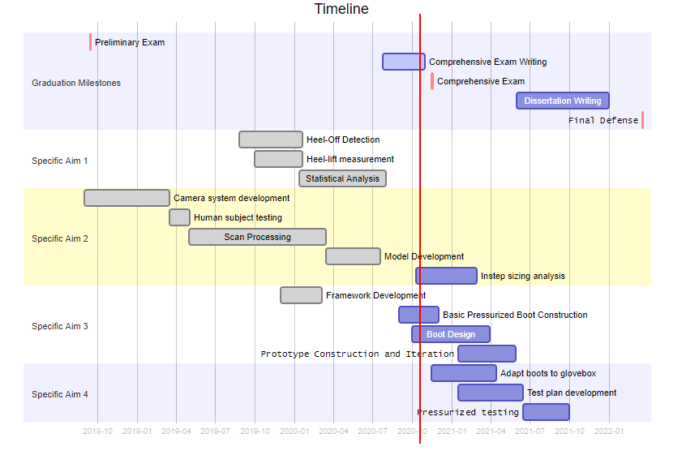

# Summary and Execution Plan

Through many advancements of planetary EVA spacesuit design, operator-spacesuit coordination is still not perfectly matched. 
Poor mobility and poor fit between the operator and spacesuit are some of the most common factors that can lead to injury.
This thesis aims to determine the feasibility of using dynamic body shape models to improve spacesuit component fit and mobility, specifically with planetary spacesuit boots.
The spacesuit boot has demonstrated specific problems relating to poor fit, such as heel-lift and contact injuries. 
The work in the thesis aims to answer the hypothesis:

> Integrating dynamic body shape changes into the spacesuit boot design process will mitigate factors that lead to injury and improve compatibility between the operator and the spacesuit. 

To date, the following contributions have been completed:

- Showed drawbacks and identified areas of future implementation for how IMUs could be used to detect instances of heel-lift
- A novel software library to use multiple commercial depth cameras as a cost-effective 4D scanner, capable of collecting body shape changes at 90 frames-per-second
- A parametric statistical shape model that predicts dynamic foot shape during stance phase as a function of anthropometry and kinematics
- A design framework integrating dynamic foot shape knowledge with known foot mobility to design a novel spacesuit boot to improve fit and comfort

This thesis aims to provide the following contributions during the remainder of its course:

- Quantification of dynamic changes in instep height and instep girth as they relate to their distribution in the global population
- A novel spacesuit boot prototype developed from the framework that aims for better fit and comfort, and specifically a reduction in heel-lift
- Evaluation of the novel spacesuit boot for comfort and mobility against current planetary spacesuit boot technology and a gold-standard hiking boot

Through these contributions, this thesis aims to show the efficacy of dynamic body-shape models in improving spacesuit component design for fit, comfort, and mobility, thereby answering its hypothesis. 
While the efforts of this thesis were demonstrated on a planetary spacesuit boot, the presented work aims to serve as a foundation for other spacesuit component designs where fit may be an issue, such as the HUT and gloves. 
The work presented in this thesis also aims to be translational for terrestrial footwear, contributing a new capture tool and modeling technique to improve footwear fit and comfort for a variety of activities. 

## Publication Plan
[Table @tbl:pubs] outlines the peer-reviewed conference and journal papers from this thesis work. 
[Table @tbl:conf] outlines conference presentations and posters from this thesis work. 
Publications and presentations which are proposed and subject to having their title changed. 

\pagebreak

| Type | Title | Journal | Status |
|-|----|---|--|
| Technical Note | Detecting Heel-Lift in Spacesuit Gait | Aerospace Medicine and Human Performance | In Prep., expected Nov 2020 |
| | | | |
| Journal Paper | DynaMo: Dynamic Body Shape and Motion Capture with Intel RealSense Cameras | Journal of Open Source Software | Published |
| | | | |
| Journal Paper | Dynamic foot morphology explained through 4D scanning and shape modeling | Journal of Biomechanics | Under Review |
| | | | |
| Conference Paper | A Biomechanical Design Framework to Improve Spacesuit Boot Fit | 50th International Conference on Environmental Systems | Published |
| | | | |
| Journal Paper | Static and Dynamic Distribution of Instep Height | Footwear Science | Proposed, expected Mar 2021 |
| | | | |
| Journal Paper | Design of A Novel Planetary Spacesuit Boot Design | Acta Astronautica | Proposed, expected Aug 2021 |
| | | | |
| Journal Paper | Comfort and Mobility Evaluation of a Novel Planetary Spacesuit Boot Design | Aerospace Medicine and Human Performance | Proposed, expected Feb 2022 |

: Peer-reviewed publications {#tbl:pubs}

\pagebreak

| Type | Title | Conference | Date |
|-|----|--|-|
| Talk | Using dynamic foot morphology data to design spacesuit footwear | Footwear Biomechanics Symposium | July 2019 |
| | | | |
| Talk | Development of a Dynamic 3D Scanning System with Multiple Intel RealSense Depth Cameras | International Society of Biomechanics Congress | Aug 2019 |
| | | | |
| Poster | Quantifying the Heel-Lift during Spacesuit Gait | NASA HRP IWS | Jan 2020 |
| | | | |
| TBD | Dynamic Body-Shape Models to Reduce Risk OF EVA Spacesuit Injury | NASA HRP IWS | Feb 2021 |
| | | | |
| TBD | Novel Spacesuit Boot Design Developed from Dynamic Foot Shape Modeling | Footwear Biomechanics Symposium | July 2021 |
| | | | |
| TBD | Spacesuit Boot with Improved Comfort and Mobility Developed from Dynamic Shape Modeling | NASA HRP IWS | Jan 2022 |
: Conference Presentations and Posters {#tbl:conf}

## Academic Requirements

All required coursework was completed as of the Spring 2020 semester. Of the 36 required credits, 30 were taken in ASEN, with 12 at the 6000 level. MCEN 5228 (Modeling Human Movement) and APPM 5590 (Statistical Modeling) were taken outside of ASEN. The 6 required math credits were exceeded with taking ASEN 5519 (Experimental Design and Statistical Analysis), APPM 5590 (Statistical Modeling), and ASEN 5044 (Statistical Estimation for Dynamical Systems). As of the Fall 2020 semester, 15 out of the 30 required Doctoral dissertation credits have been taken. The remaining 15 credits will be evenly taken during the Spring 2021, Fall 2021, and Spring 2022 semesters. The teaching practicum has been fulfilled through the mentoring of UROP students in the Summer 2018, Fall 2019, and Spring 2020 semesters. A  TA position is also expected in Fall 2021. 

## Timeline 

[Gantt chart @fig:Gantt] shows the timeline for each specific aim of the thesis and for PhD graduation milestones.

{#fig:Gantt width="100%"} 
