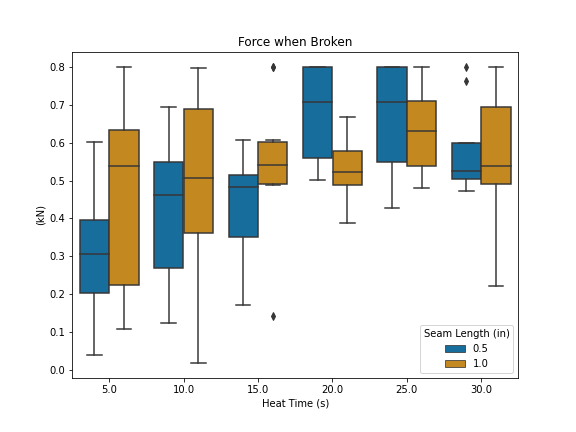

\bibliography{../references}
\appendix

# Tensile testing of pressure bladder seam {#sec:AA}

Urethane-coated nylon, the material used for a spacesuit's pressure bladder, is sealed to itself by applying heat.
The heat melts the urethane layers on both pieces of fabric, fusing it into one layer.
After discussing with subject matter experts, a good seal was described as one where when stressed, a failure occurs in the nylon and not the urethane. 
However, there does not exist a clear guideline on how much heat needs to be applied to urethane-coated nylon to achieve a good seal. 
Therefore, this evaluation explores the relationship between heat and seam strength for urethane-coated nylon. 
Furthermore, the seam size is also explored to see if there is an effect. 

Coupons were manufactured as two strips of 2 in material, with an overlap of either 0.5 in or 1 in seam. 
These coupons were then heat sealed with a Clover MCI-900 Mini-iron, set to a temperature of 140 degrees Celsius (high setting). 
The time of heat application for these coupons was varied between 5 and 30 seconds in intervals of 5 seconds. 
A total of 10 coupons for each heat application time and seam size were manufactured, for a total of 120 coupons. 

The coupons were subject to the ASTM Standard Test Method for Breaking Force and Elongation of Textile Fabrics (ASTM D5035). 
This test was conducted on an Instron tensile test machine, recording the elongation and force as the machine extended at a rate of 300 mm/min. 
The coupon test setup is shown in [figure @fig:A1-setup].

{#fig:A1-setup width="40%"}

When the sample failed, the force recorded by the Instron machine immediately decreases. 
The derivative of the force was taken, and the first negative change of force value was used to denote the point at which the sample failed. 
The distribution of the force at which samples failed is shown in [figure @fig:A1-results]. 
Lower force values were noted as failures of the urethane layer ([@fig:A1-delam]), while higher force values were noted as nylon failures ([@fig:A1-rip]). 

{#fig:A1-results width="80%"}

{#fig:A1-delam width="40%"}

{#fig:A1-rip width="40%"}

The results show that above 20 seconds of heat application is generally associated with higher forces for breakage. 
Therefore, all fabric for this project was heat-sealed for a minimum of 20 seconds. 

